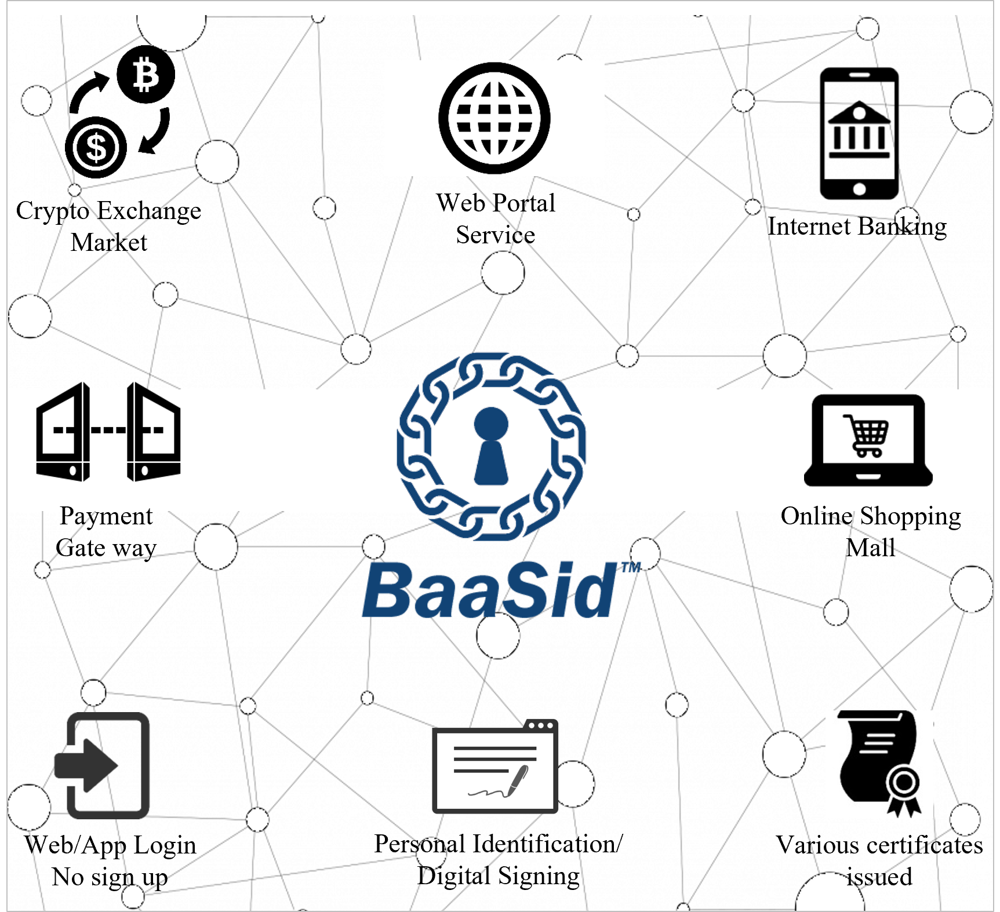

# 1.10  "DB Governance” of BaaSid Participants

"BaaSid" does not particularly discriminate between blockchain based services and web or app based services. The user (participant) needs both services, and this is because the users benefit providers in various ways.

**"BaaSid" participants are clients that are already aggressive and have potential, and they make up the Decentralized database for a safe login and verification where they trust one another and verify one another.**

In other words, "BaaSid" participants can access all websites (application standard of "BaaSid's" API) including those of financial institutions, banks, brokerages, and retail with tight security and convenience, quickly and safely. "BaaSid" has this type of potential customer infrastructure and users and is also a form of "verification managed governance."

<figure><figcaption></figcaption></figure>
