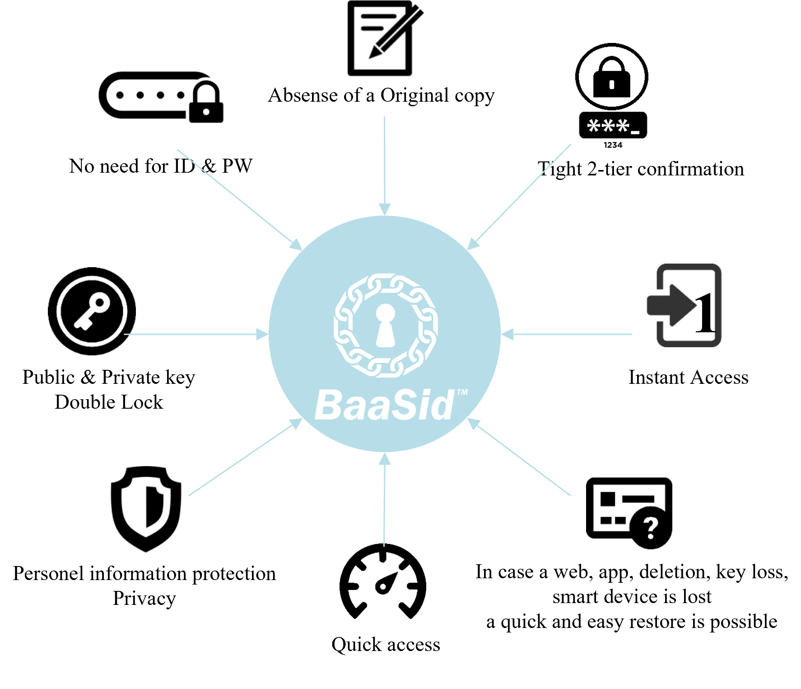

# 1.9  BaaS Certification API Service

For personal originality and privacy protection “BaaSid” saves the small fragments on an unspecified number of nodes after a random splitting and distributing of the characteristic values, and through the exchange of BAAS tokens, and various verifications, ledgers of verification, which creates and preserves credibility.

This uses a verification method known as Proof of Access (POA), which is an active ecosystem that periodically verifies utilization through major activities on line including the login and all other aspects of internet service by the user.

The BaaS based Certification of public or Private Network API verifies and continually connects based on the active and natural activity of such users.

<figure><figcaption></figcaption></figure>
