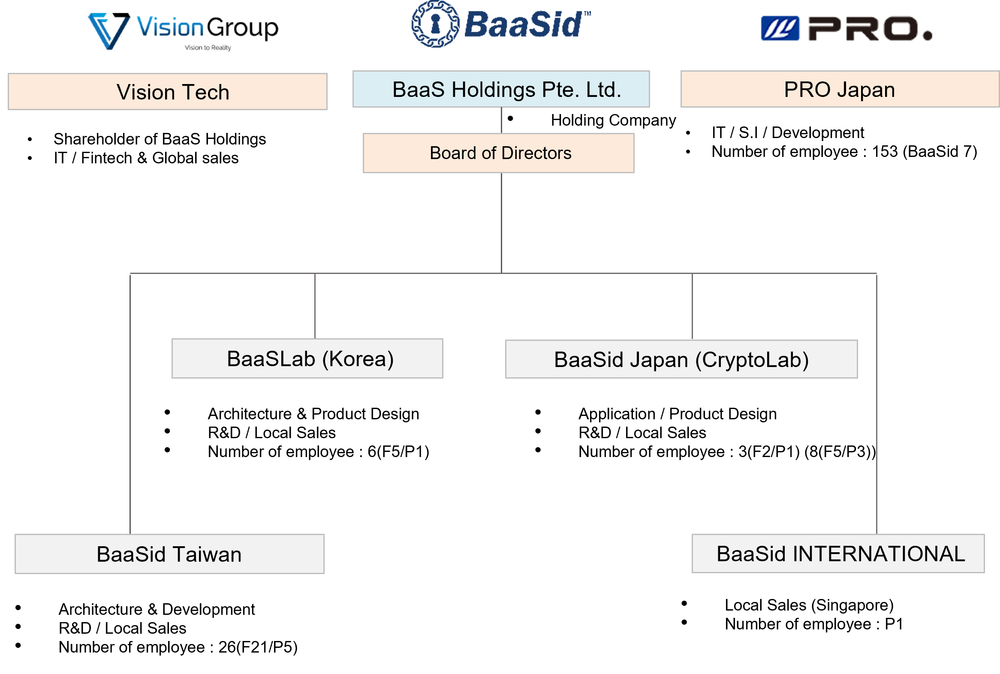

# 8.1. Organization

BaaS Holdings Singapore / BaaSid Taiwan(26 people), BaaSid Lab Japan(3 people), CryptoLab Japan(8 people), PRO Japan(7 out of 153 developers developed BaaSid), BaaSLab(6 people), BaaSid International (1 people), currently has a total of 51 people(40 full-time, 11 part-time) working, and 11 experts in each field are supporting BaaSid as technical, finance, accounting, legal and IPO advisors.

<figure><figcaption></figcaption></figure>
