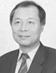

# 8.3. Advisor

### K.S. Lu (Taiwan)

* Chairman of Leadtek Research Inc.(TWSE) – **Current**
* Awarded National outstanding SMEs
* The president of Chinese Taipei Football Association
* The executive committee of East Asian Football Federation
* The marketing committee of Asian Football Confederation

### Hajin Jhun (KOREA)

* Chairman of the KBA self-regulatory committee (Korea Blockchain Association)
* Chairman of SDX foundation
* 19th Member of the National Assembly (KOREA)
* Former Chairperson of Digital Party of Sunnuri Party&#x20;
* Former CEO of HANCOM(KOSDAQ)

### Kumakiri Yasutomo (JAPAN)

* Vice President(COO) of Creators Guild.Co,ltd(Impress Group) - **Current**
* CEO of Creators Guild.Co,ltd(Nippon Group)
* Director of Electronic publication
* Director of Web planning & production
* Manager of Advertising dep(international telecommunications company)

### Ronald H. Chen (Taiwan)

* MBA, JD
* Director of T-Star Telecomm Corp. - **Current**
* Supervisor of the Board, CSun Manufacturing LTD.
* Independent Director of Advancision Corp.,Cayman
