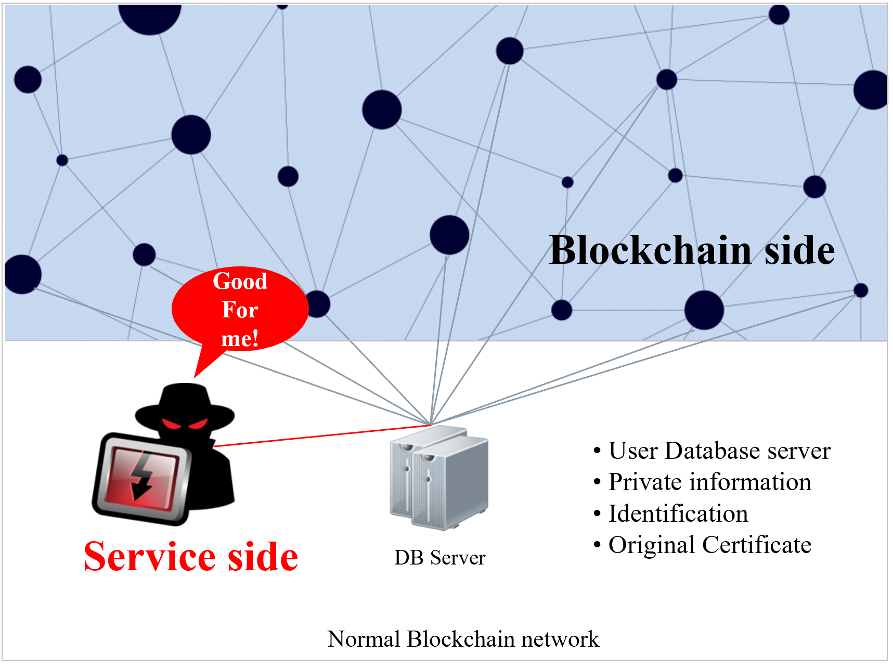

# 2.1. Limitations of and problems with blockchain

As was mentioned above, all intenet services store and later use a large amount of personal information that is stored on databases. Based on this, login, information confirmation, payment and all other user requests are verified by a provider and a third party verification authority.

This goes for services other than those that apply blockchain technology and includes all agencies, organizations, corporations and all free and charged services. And as a given, various security systems are developed and operated to protect such databases.

Also, the problem major leaks and hacking has resulted in governments of several countries to enact protecive legislation regarding personal information over the internet, and along with messages condemning the leakage and piracy of such personal information, many individuals, and all companies, financial institutions, agencies and organizations that have an online presence are requesting more effort be devoted to this problem.

Further, the blockchain world that is oriented towards decentralization is continually becoming more centralized, and with various targets susceptible to hacking and new problems that arise as a results, more ironic limitations are taking shape.

<figure><figcaption>
Blockchain service that shows other limitations of centralization
</figcaption></figure>
