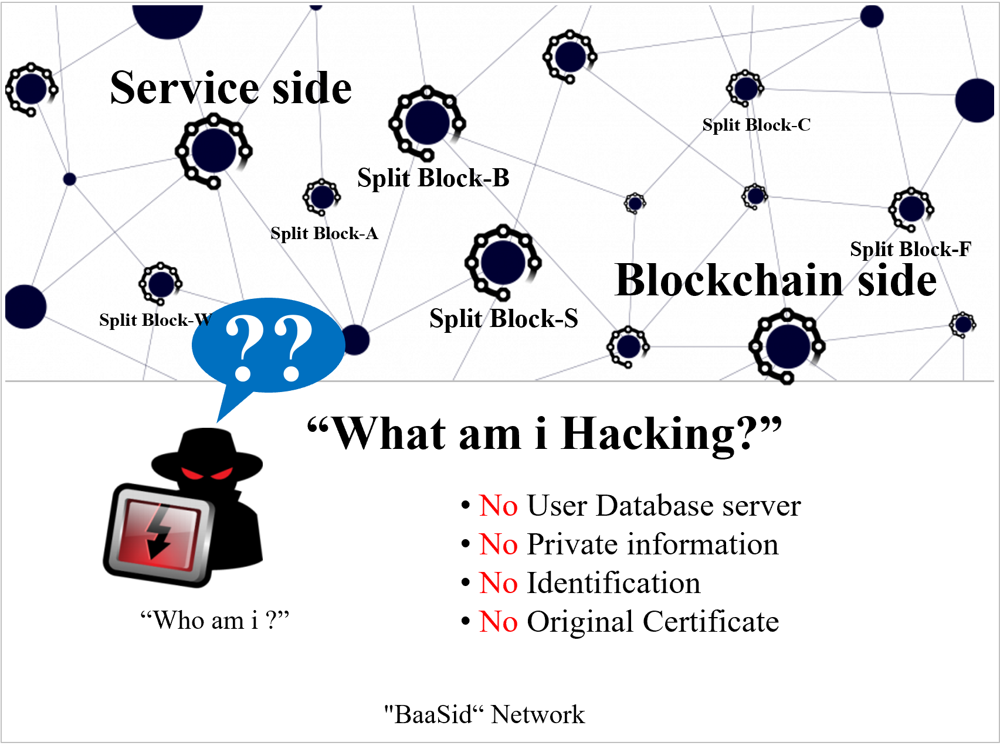

# 2.2. Borrowing the DB of BaaS based participants

All blockchains save transactions records the same way and offer tight security against forgery or falsification. This is because the same data, users’ sensitive personal information and important information, and verifications keys are held by everyone making it difficult to store any of that information.

"BaaSid" takes the most fundamental uniform data storage problems and limitations of blockchain, and offers an interpretation in a completely new perspective.

When verifying information required for the personal verification a "BaaSid" participant, there is no source to forge because it is not stored anywhere thus blocking any hacking attempts.

In other words, with "BaaSid" the personal information, biometric images and any other information of a user does not exist in any format whatsoever and does not even exist on one's device. It is only saved after being split and distributed (means some of the encrypted data fragments are separated from one another and distributed to participants) as fragments on the nodes of public or Private network(Company).

<figure><figcaption>
Highest form of decentralization through a blockchain database infrastructure
</figcaption></figure>
