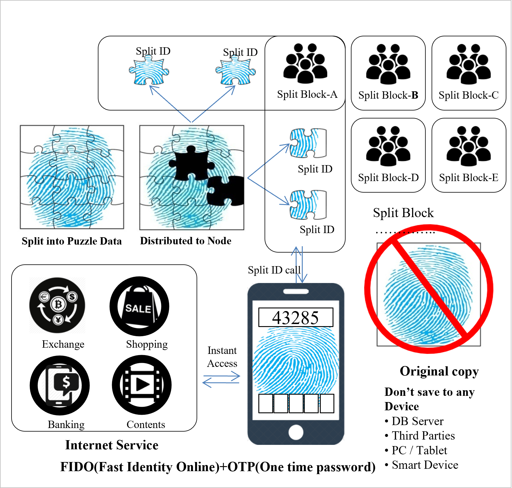

# 2.3. Split & Distribute Data

The personal information of all participants of the Public or Private Network is split into thousands of fragments, and the encrypted data fragments are split up and saved among hundreds of thousands of unspecified individuals participating in the split. The encrypted, split personal information fragments are called the Split ID, and the thousands of split fragments are then again split and divided into hundreds and thousands of split blocks.

The capacity, distributing and saving will be optimized to increase the real-time speed of recognition, and the node numbers of the split block that were distributed based on the safety of blockchain against hacking attempts will be optimized as well.

<figure><figcaption>
Instant Access Verification
</figcaption></figure>
