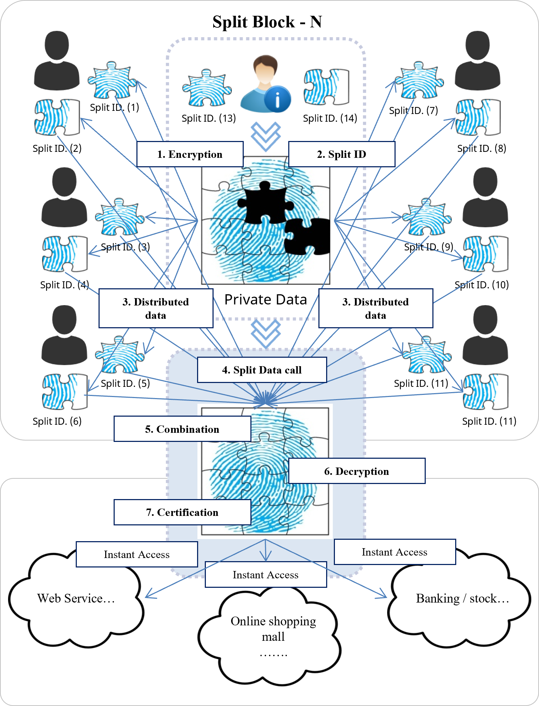

# 2.4. Verification that is user-centered based on the Public or Private Network

When logging in to an internet service, applying for membership, or performing other major activities such as shopping, wire transfer or the movement of other financial assets, the split password fragments are saved on a split block and then temporarily the split ID (split data) fragments are verified via the instant verification that uses an individual's biometrics (fingerprint, iris, voice recognition, etc.) or a password (option) and One Time Password (OTP) that reminds an individual of the password and immediately discards the source afterwards.

<figure><figcaption>
Temporary Centralization based on an Individual
</figcaption></figure>
