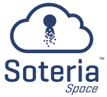
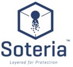
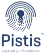

# 5.2. BaaSid Product and Solutions

<figure><figcaption></figcaption></figure>

1. Blockchain SaaS File Management and Access Control
2. Multi-layer Encryption Technology
3. Multi-Factor Authentication
4. Data Storage Compliance with customized policies and flows

<figure><figcaption></figcaption></figure>

1. Blockchain Distributed Storage API integration Module
2. Suitable for Cloud and On-Premise
3. Blockchain L2 Solution for Enterprise

<figure><figcaption></figcaption></figure>

1. Blockchain Distributed ID Authentication API solution
2. Multi-Factor OTP Authentication
3. In-house development security module
4. Source data distributed in separate node
