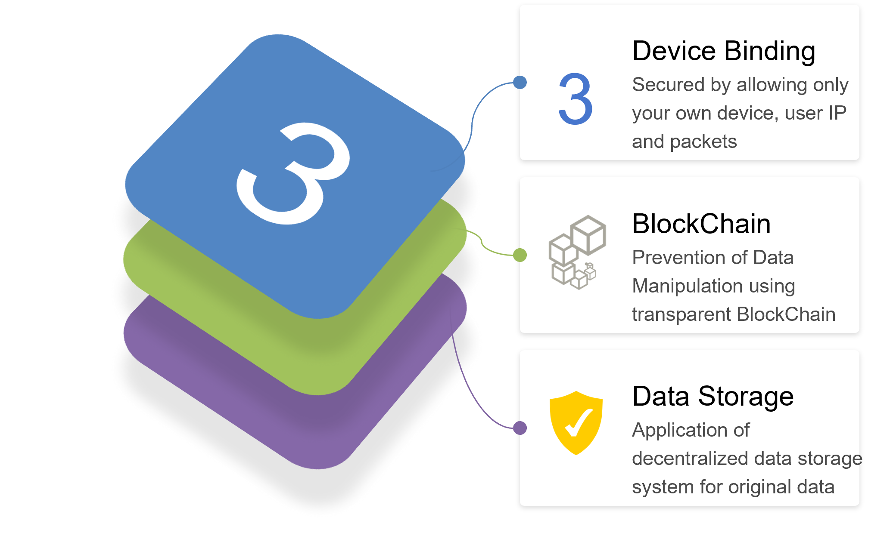

# 5.5. Detail of Pistis

.png>)

## Pistis Multi-Factor Authentication

<figure><figcaption></figcaption></figure>

## BlockChain Enabled Multi-Factor Authentication

Multi-verification authentication via biometric data such as fingerprint, face ID or iris recognition with the use of BlockChain to enhance data protection
