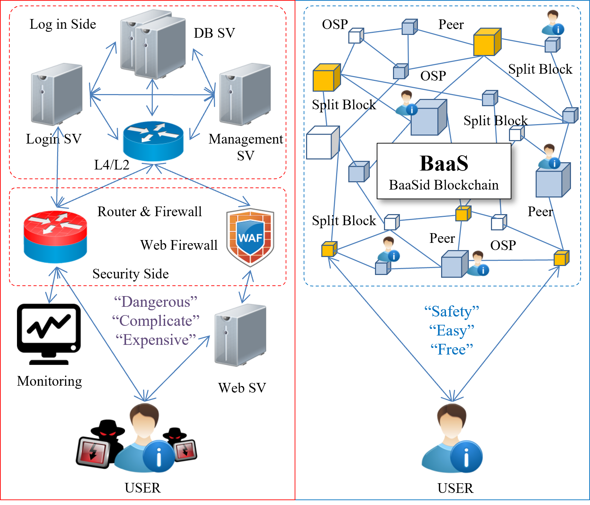
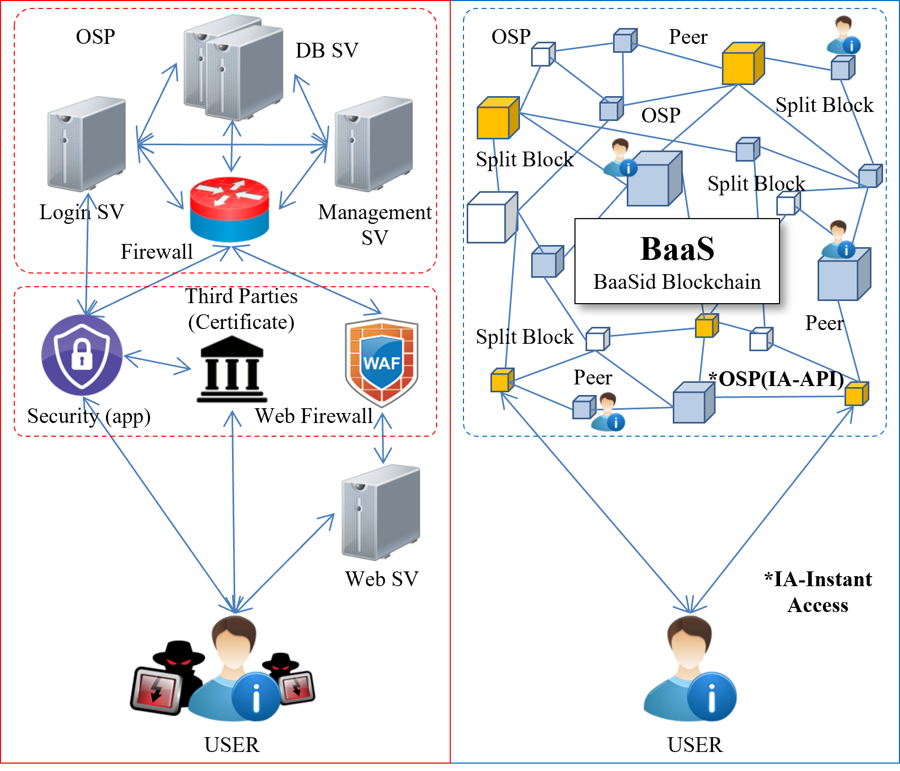

# 3.2 The Benefit of OSP using  API of BaaSid

## Benefit.1)

The API of "BaaSid" is provided to all internet service providers enabling easy application for all. Internet service providers are no longer required to invest large sums in the installation and operation of a database and security system for relevant proprietary services.

<figure><figcaption>
Comparison between general internet service systems and the BaaSid “BaaS” Infrastructure
</figcaption></figure>

## Benefit.2)

"BaaSid" participants (users) gain one-time instant access through\[encryption>fragmentation>summon>correlation>descrambling>biometric verification] through a temporary centralization through instant verification via fingerprints, iris scans or other biometrics enabling participants to immediately obtain membership on their own, and enable them to gain immediate access without any additional verification steps. From a service providers standpoint, this prevents many customers from being lost due to the procedure for membership application.

The irksome development of various databases for login and other verification steps, and for other verification or all the access steps not necessary.

In other words, it means that the services of all providers can be quickly and easily used. This equates to freeing providers from marketing costs and the various difficulties in attracting members to apply for membership. As an optimal method for enhancing the marketing effectiveness of internet service suppliers this is a dramatic simplification and credibility enabler for both procedure for membership application, and the verification steps that actions within the service entail, which could become an important strategy for enhancing the service revenue of suppliers.

<figure><figcaption>
Comparison between Regular Login/Verification and Instant Access
</figcaption></figure>

## Benefit.3)

### Quick and easy important verification: “Hyper Confirm API”

All banks, financial institutions, brokerages, retail and other paid content payments require a diverse and complex series of steps that includes a certification procedure from a third party certification authority, and a link-up with a Payment Gateway (PG).

With "BaaSid," there is plan to develop and offer a HC-API(Hyper Confirm API) which can more easily and safely resolve current complex and inefficient verification steps that should be followed with a BaaSid Blockchain infrastructure.

<figure><figcaption>
Comparision between Regular Internet Payment Verification BaaSid
</figcaption></figure>
