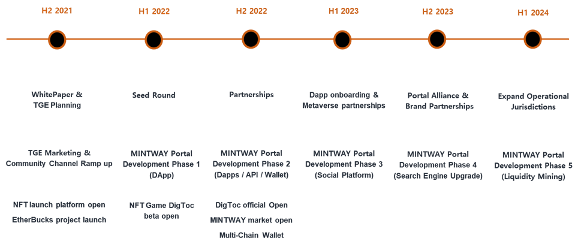

# 1.3 Decentralization!

In the "BaaSid," via "one-time instant access" that utilizes a certification of public network, participants and providers alike can attain quicker verification with tighter security and greater ease.

In particular, sensitive personal information including, name, phone number, email address, ID, password, credit car numbers, biometric information, etc. is split, after which it is split into data fragments unique to the hundreds and thousands of nodes, which are then distributed and saved different from one another, enabling verification, login and other functions to be peformed in the absense of a source of such personal information.

<figure><figcaption>
COPN : Certification of Public Network
</figcaption></figure>

Here, this means that an individual temporarily makes oneself centralized, then summons, descrambles and combines the split ID that was encrypted thousands of times from the Certification of Public or Private Network of the “BaaSid” via a “biometrics verification key,” after which the information is instantly discarded the instant the “one-time instant access” is complete.

The "BaaSid one-time instant verification" is a method where an internet service provider develops and maintains another centralized database, or undergoes a "third party certification authority" or in the absence of a source to compare, based on the Certification of Public Network of "BaaSid," an unspecified number of participants are verified.

This is the total opposite method that has been employed so far on the internet which was composed of an individual certification structure for everyone. Yet, the goal of "BaaSid" is to create a link between blockchain and non-blockchain methods, perform verification in the absense of a source, and to achieve complete decentralization through a public network consisting entirely of participants (users or Private nodes of Company) without the necessity of an authenticated certificate from a third party certification authority.
