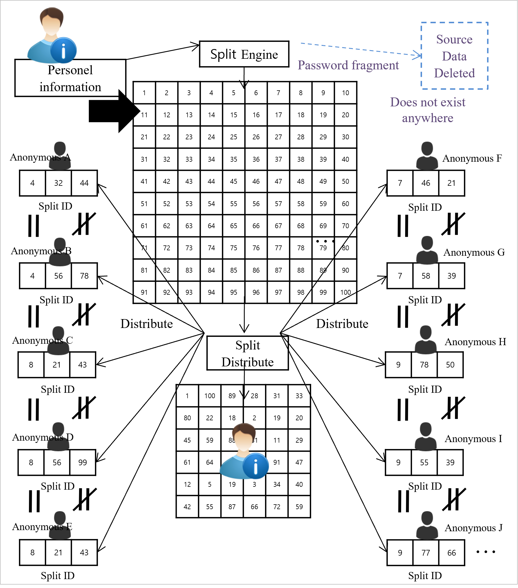

# 1.6 Split ID

The personal information of participants is split into hundreds or thousands of fragments using the split engine and all these fragmented Split IDs are then encrypted and the Split IDs that are different from one another are then stored within the split blocks they belong to.

This resembles the process of the biggest advantage of Peer to Peer (P2P), taking the values of separated data allocation and split and distributed fragments and finding the fastest nodes and data most rationally, then combining them to form something that resembles the one source that can be downloaded or restored.

<figure><figcaption>
Creation of a Split ID and Splitting Distribution
</figcaption></figure>
