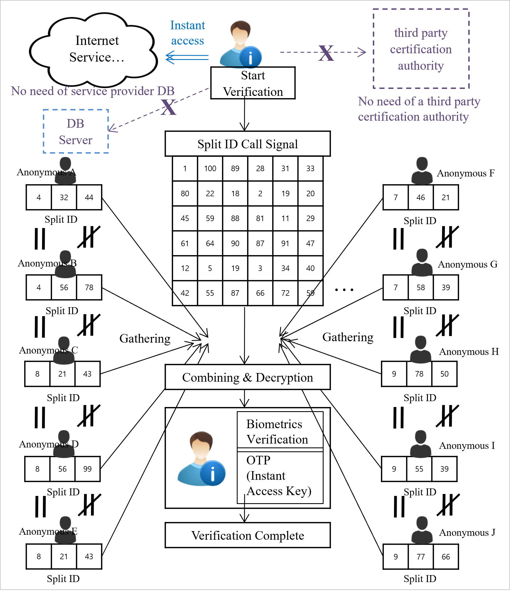

# 1.7  Combination Engine Descrambling and Verification Stage

The split IDs of the participants maintain each of the unique password codes along with the public key, and this unique split data will be maintained continuously and safety through the virtual currency wallet of "BaaSid" and through ongoing transactions.

And when participants and an unspecified number of partcipants participate to access a specific internet service, they will be mutually granted one-time instant access which confirms the verification.

<figure><figcaption>
Participation and Verification of a Split ID
</figcaption></figure>
