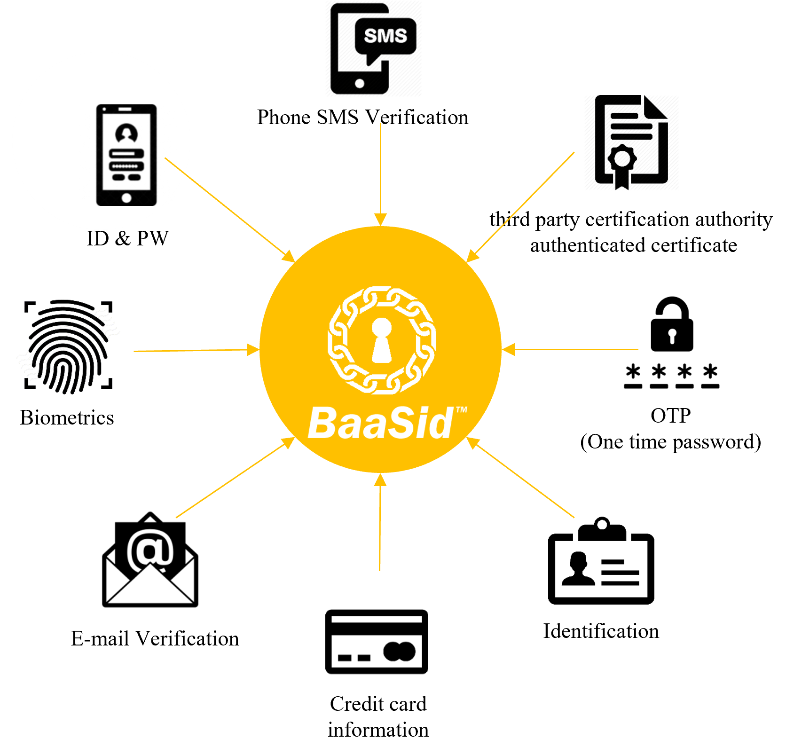

# 1.8 One Pass: an all-in-in sophisticated verification

“BaaSid” sanctions and confirms all verifications based on the consent of an unspecified number of participants.

This is based on participation(or Private network of Company) by a number of blockchains, and values that are more creative and unique from one another give it more value.

The logic where it would seem personal information or privacy should be respected and protected.

Even within the blockchain service, the practice of saving personal information on a third party institution's or provider's server that persists is no different from the centralization of banks, financial institutions and certain groupsthat preceded the start of the block chain. However, the blockchain still has no answer to that no offers any guarantees.

<figure><figcaption></figcaption></figure>
