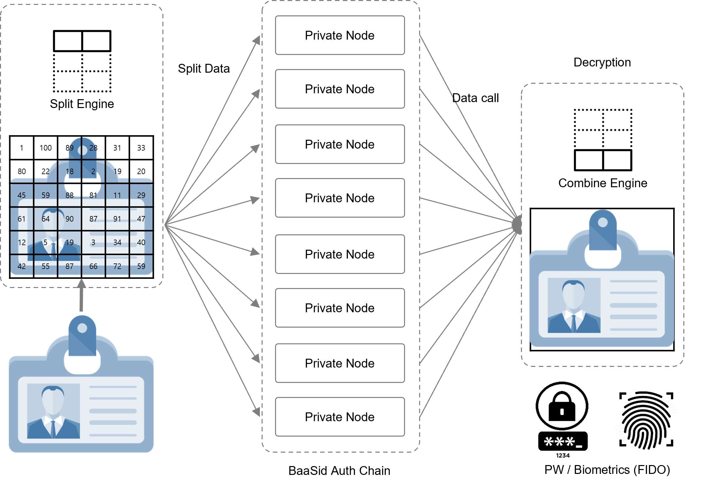

# 4.4  Private Node Configuration

<figure><figcaption></figcaption></figure>

Data Split & Save to each different node

**BaaSid**’s **** Decentralized Storage does not leave original data by separating, distributing, and partially redundantly storing fragment data of all the original pieces carved out through Split Engine into each storage. This means that not all storage stores original data but only individual pieces of data, which in itself stores only useless garbage data. In addition, De-Storage will build various business models in the process of separating such content and combining fragmented data. Copyright protection model for content data combination / Content verification model for content data combination / Online De-Storage Model for Cold Storage Replacement
