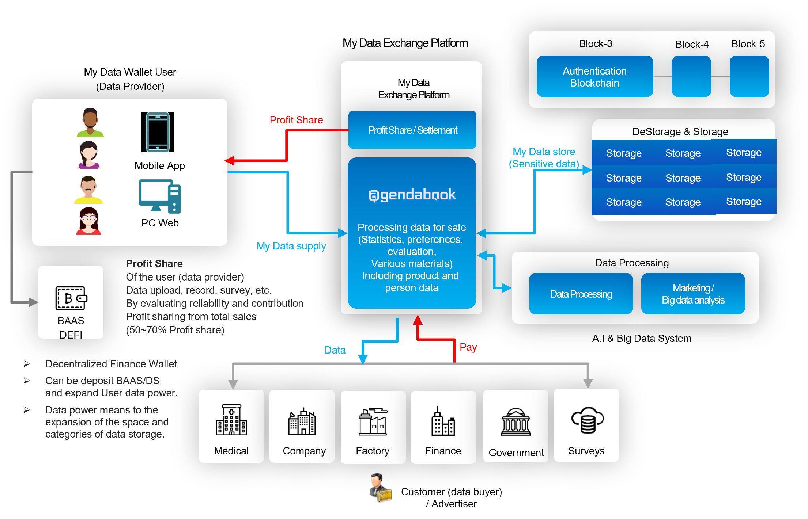

# 7.1. My Data Exchange Service

### My data Exchange Platform based on Blockchain

1. Customized my data trading platform based on non-financial my data
2. An active survey platform that makes it easy and fun to participate and earn money
3. New product promotion and pre-market research platform through product reviews, product analysis, and preferences
4. Self-directed My Data Wallet that provides personal data sovereignty
5. Next-generation social media platform based on C2C through product preference, information, and reviews
6. New concept mobile-based MID security platform without personal information storage
7. Big data, A.I-based new target advertising platform

> ### What is “agendabook”?
>
> “agendabook” is a data exchange platform by on voting, surveys, and my data based on Blockchain
>
> agendabook's 7 platform business areas are described below.

<figure><figcaption></figcaption></figure>

###  My data Exchange

1. Creating added value by converting all of the customer's thoughts, knowledge, choices, and tastes into digital assets
2. Structure in which influencers and followers (customers) create profits together
3. Providing customized data to advertisers
4. Provides new stories and content every day, fun and experience where one's digital assets accumulate (cash)
5. Application in which information, knowledge, and thoughts become money (asset)
6. Asset platform without worrying about anonymity through non-financial data and leakage of personal information

###  Surveys Platform App

1. Participate in a step-by-step (revenue weighted, daily, divided) survey so that survey participants do not get bored
2. Profit-sharing survey platform to induce active participation of survey participants
3. Survey participants and advertisers are directly connected, and survey result data is directly checked in real time.
4. A quick and cheerful money-making app where cash (points or coins) is accumulated immediately after filling out a questionnaire
5. Survey target accuracy through survey level, survey participation, reliability, and basic information
6. Interesting screen composition (UI), operability (UX) to encourage participation in surveys more actively

### New product promotion and pre-market research platform

1. A market research platform that preliminarily researches the preferences and interests of new products through product comparison (A vs B)
2. New product launch preference survey (push message to specific group through targeting)
3. Prior preference survey platform through various products and person comparison
4. Request for product comparison through an influencer (request for product comparison and analysis, review by a famous influencer group)
5. Providing a list of products (advertisers) for voluntary participation of influencer groups
6. Processing and providing various data through preference and product comparison (advertiser)

### Self-Sovereign My Data Platform Based on Decentralized

1. Safe Box for personal digital assets (passwords, Bank accounts, car information, Credit card, etc.)
2. Safe storage of important files, images, etc. (decentralized data storage)
3. ‘AVATAR’ creation and management by storing personal preferences, preferences, and sensitive information based on anonymity
4. Realization and Security of Personal Data Self Sovereign
5. Provides and controls anonymous-based financial information (when API is interlocked) (however, when government My Data provider is selected)
6. Various identification cards through DID (Decentralized ID), other identification data wallet

###  Next Generation Social Media Platform

1. Product information community such as SNS-based product comparison, product review, new product usage period, etc.
2. Launching of new products and preliminary market research through new product reviews (opening period)
3. Rapid information dissemination based on SNS, product trust and merits, and promotion platform
4. Creation and spread of new contents through short answer type, questionnaire type, and confrontation type (one-to-one product and person comparison)
5. Influencer group management and advertiser connection platform in each field
6. Interworking with various SNS Tools

###  Mobile ID (MID) security platform

1. Anonymity protection through MID, secure ID without storing personal information
2. Provide a more honest and detailed data collection environment through anonymity
3. Secure reliability through evaluation / level / proof of participants on an anonymous basis
4. Expansion of authentication business using 2FA and MFA (Multi Factor Authentication)
5. Super easy signup for Google, KakaoTalk, Line, Naver, etc. (1 click, 1 second sign-up process)
6. Decentralized ID system for data recovery (inducing update by level)

###  Target advertising / Voting / Survey platform

1. Detailed classification of participants and detailed target setting through various anonymous data pools
2. Induce continuous data updates and provide benefits from participants' first sign-up
3. Advertiser charge charge & real-time survey and provision of advertisement platform that can check data
4. Providing push messages and surveys to real-time participants (customers), and participant data to advertisers
5. Real-time data verification through push message (App) (advertiser)
6. Provision of various advertising products (new products, product comparison, influencer request, real-time survey, participant survey, etc.)
