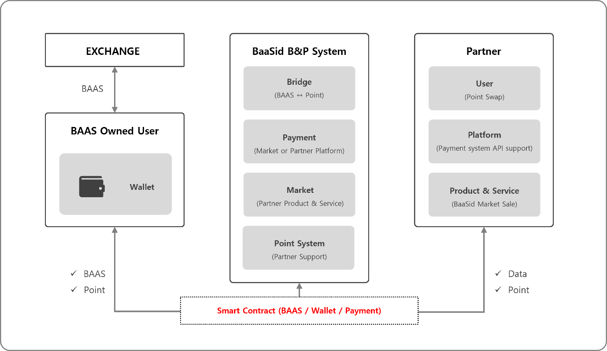

# 7.2.1. BaaSid B\&P System

<figure><figcaption></figcaption></figure>

The BaaSid B\&P system is a system that supports the bridge, payment, market, and point systems as requested or needed by partner companies and partners' users, and each system is modularized as a unit.

In particular, , the document is supported so that it can be accessed through API by composing one content in the partner's platform and App without accessing the BaaSid platform.

Smart contracts such as swap and payment system through bridge, simple payment and wallet transfer are operated according to ERC-20 made by BAAS, so general users can easily access it, and all systems are designed to support dashboards so that partners can operate and manage them easily. Partners are free to use these services.
