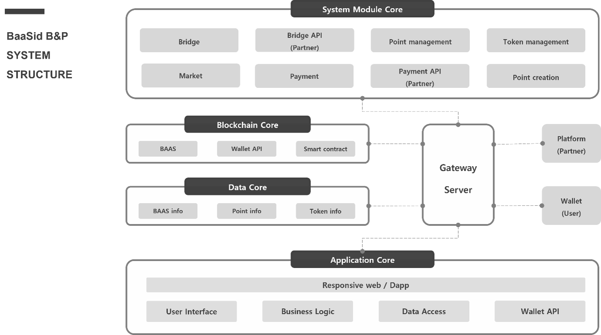

# 7.2.2. BaaSid B\&P Structure

<figure><figcaption></figcaption></figure>

#### <mark style="color:blue;">A. System Module Core</mark>

The system module core is a core with a unit module system that provides services of BaaSid B\&P, and provides the core system of BaaSid B\&P.

<mark style="color:green;">**Bridge**</mark> <mark style="color:green;"></mark><mark style="color:green;">:</mark> <mark style="color:orange;"></mark> Swap partner's points or tokens with BAAS according to policy standards

<mark style="color:green;">**Bridge API**</mark> <mark style="color:green;"></mark><mark style="color:green;">:</mark> Supports API that can be linked with Bridge when partner's platform wants to directly swap with BAAS

<mark style="color:green;">**Point management**</mark> <mark style="color:green;"></mark><mark style="color:green;">:</mark> Manage partner's points, reserve for BAAS payment, swap size, etc.

<mark style="color:green;">**Token management**</mark> <mark style="color:green;"></mark><mark style="color:green;">:</mark> Manage partner’s tokens, reserve for BAAS payment, swap size, etc.

<mark style="color:green;">**Market**</mark> <mark style="color:green;"></mark><mark style="color:green;">:</mark> Registration, sales and management of partner's products and services

<mark style="color:green;">**Payment**</mark> <mark style="color:green;"></mark><mark style="color:green;">:</mark> BAAS payment system (Smart contract such as QR, barcode)

<mark style="color:green;">**Payment API**</mark> <mark style="color:green;"></mark><mark style="color:green;">:</mark> Interlocking BAAS payment system within partner's platform and app

<mark style="color:green;">**Point creation**</mark> <mark style="color:green;"></mark><mark style="color:green;">:</mark> Point generation and management system will be provided when partners request the development of points that can use BaaSid B\&P

#### <mark style="color:blue;">B. Blockchain Core</mark>

The blockchain core provides the foundation for a secure transaction system such as BAAS Swap in BaaSid B\&P, interlocking with wallets where users can receive BAAS, payment for goods and services in the market, and smart contracts for BAAS Swap.

#### <mark style="color:blue;">C. Data Core</mark>

Data core is a core that stores and processes all data information generated by BaaSid B\&P. It stores various information such as quantity, transaction, and withdrawal of BAAS, points, and tokens, and provides information to partners and users by calling from the dashboard.

All of this is delivered through the gateway server, and in particular, the collected information is distributed and stored in each node through the distributed storage function of BaaSid.

#### <mark style="color:blue;">D. Application Core</mark>

BaaSid B\&P is serviced with a responsive web and APP, and partners' users can easily access it. When partners need it, it can provide services to users by connecting the Bridge and Payment API, and it provides business logic according to the user interface and system suitable for each partner.
