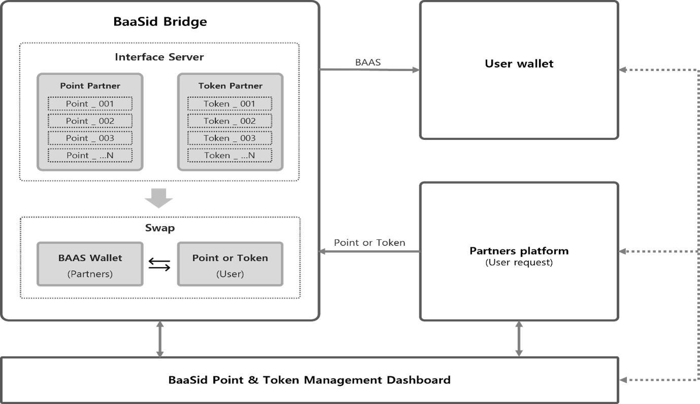

# 7.2.3. BaaSid Bridge

<figure><figcaption></figcaption></figure>

BaaSid Bridge provides a service to swap partner's points and tokens with BAAS, and through this, users of partner companies can convert their points to BAAS to purchase goods and services, or to cash out through an exchange.

To use the service, partners can manage the size of BAAS swap, recharge of BAAS, exchange rate, etc. through the dashboard after making contract with BaaSid and linking points to BaaSid Bridge.

Partner's points must be stored and deleted by themselves, and the exchanged points can be checked through the dashboard. In order to verify the user, the partner must manage the user ID and wallet address by matching them.

The BaaSid Bridge service can be operated according to the policy to the partner company, and in order to provide the service continuously, BAAS according to the point swap must be charged to the partner’s wallet.

The fee for using the BaaSid Bridge is free, and the gas fee is borne by the exchanger when exchanging BAAS.

In order for partners to swap tokens, they must be listed on the exchange. At this time, it can be exchanged in N:N according to the market price by linking with the exchange.
