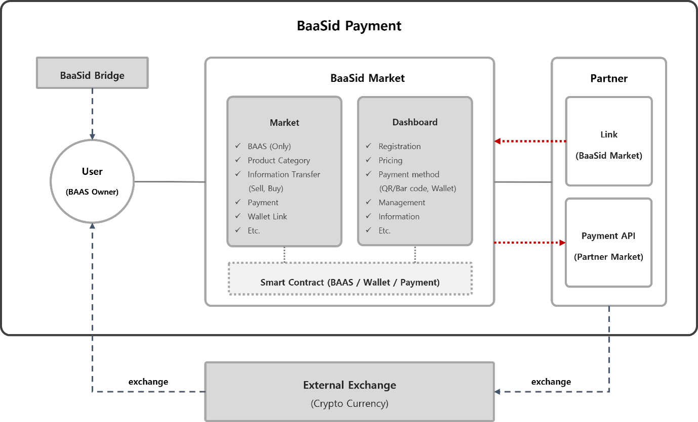

# 7.2.4. BaaSid Payment

<figure><figcaption></figcaption></figure>

BaaSid Payment is a system that can pay with BAAS in marketplaces that sell partners' products (services) and in platforms (App, Dapp, market) directly operated by partners.

BaaSid operates a marketplace that sells partner's products, and partners connect the marketplace to their platform so that users can use it, or connect the BaaSid Payment API to their platform to allow users to purchase products with BAAS.

Any user who owns BAAS can purchase partner's products at any time on the marketplace and platform where BaaSid Payment is applied, and BAAS can be swapped in the BaaSid Bridge or purchased from an external exchange.

Partner companies can register products, set prices and payment methods, and check and manage sales information through the dashboard provided by BaaSid, and the partners must deliver and service products directly.

All of this is executed by a smart contract, and the partner must open and connect a wallet for BAAS in advance.

In addition, escrow and necessary technology according to partner's products will be provided as API Documents after development.
