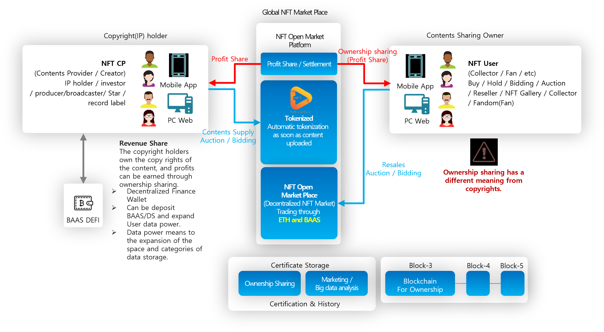

# 7.3. NFT Open Market Place

###  B2C / B2BC NFT Open Market Place of entertainment contents

1. NFT-based Making Film, Behind Story, Tokenized Platform for Undisclosed Contents
2. New value added to undisclosed contents of music, movies, dramas, and TV programs
3. An open marketplace produced and uploaded by entertainment companies, broadcasters, entertainers, and stars.
4. Induce valuation and transaction activation of true NFT tokens through global fandom
5. Win Win platform that provides revenue to both NFT (Token) Sharing Owner & original IP Holders / Creator
6. A global marketing platform for content globalization, marketing, and promotion
7. Open Market Place such as auction, bidding, resale, collector, etc. with owner sharing (Not means Copy Rights)

> ### What is “Behind Story”?
>
> "Behind Story" tokenizes making films or unreleased contents of movies, dramas, TV shows, music, and other various contents.
>
> In addition, it is an open market platform that supports various transactions of content NFT tokens initially issued by producers (IP Holders, copyright holders).

<figure><figcaption></figcaption></figure>

###  Content Tokenized Platform

1. Detailed classification of participants and detailed target setting through various anonymous data pools
2. Induce continuous data updates and provide benefits from participants' first sign-up
3. Advertiser charge charge & real-time survey and provision of advertisement platform that can check data
4. Providing push messages and surveys to real-time participants (customers), and participant data to advertisers
5. Real-time data verification through push message (App) (advertiser)
6. Provision of various advertising products (new products, product comparison, influencer request, real-time survey, participant survey, etc.)

###  Creation of new added value of undisclosed video

1. Creating new added value of sleeping making film, unreleased video, and NG video content
2. Global video sales and promotion of behind-the-scenes (meals) that fit the trend of the times
3. Promotion and marketing of new attractive contents through the disclosure of various undisclosed videos

### Open marketplace

1. The first content provider, producer, and IP holder can open “NFT Gallery”
2. Activation of transactions through resale of buyers (share owners), NFT gallery, etc.
3. An open marketplace where anyone can easily sell and buy shared ownership of content

###  Next-generation global fandom community

1. A market where SNS-based fandom can access new undisclosed content for the first time
2. Purchasing through fandom, shared ownership, purchasing power and activation of transactions
3. Global fandom community platform through next-generation marketing, promotion, and SNS

###  NFT content sharing owner & provider (copyright) win win platform

1. Available for auction sale and general sale of the first content provider (copyright, IP holder)
2. Share owners can resell additionally through resale, auction, etc.
3. Additional incentives to the original supplier (copyright, IP holder) when reselling content

###  Global marketing platform

1. The first release of new songs, new movies, TV series, etc. and the role of marketing/promotion platform
2. New marketing/promotion platform through fandom through SNS function
3. Expect new content to be uploaded and promoted/marketed to users around the world.
4. Dissemination of content through SNS to “non-NFT market”

### Various trading platforms such as sale, auction, and resale

1. Provides various trading tools such as resale and auction of NFT gallery, general users, and professional collectors
2. Provision of various sales methods (auction, general sales, shared owner quantity) of the first supplier (copyright holder, IP holder)
3. Purchasing power and high added value can be set with various options from sellers
