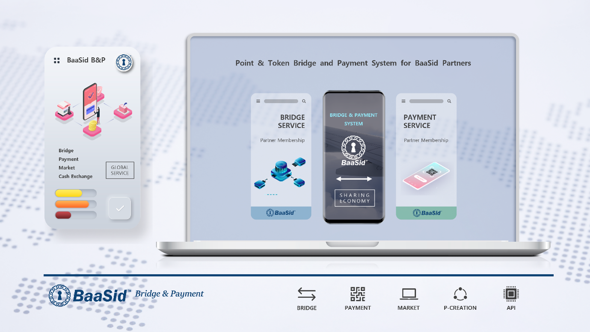

# 7.2. BaaSid B\&P

<figure><figcaption></figcaption></figure>

BaaSid B\&P is a new service provided to DApps using the BaaSid mainnet or to partners using the private chain of BaaSid technology.

#### The services are as follow:

1. BaaSid Bridge where points and tokens used by partners can be exchanged with BAAS
2. Provide a dedicated market that sells partners' products and services and a payment system that allows you to pay with BAAS
3. Provide BAAS linkage and point system to partners who need a point or token system.

Through this, users of partners can pay for goods and services by exchanging points and tokens with BAAS, and can exchange them for cash at the exchange.

In addition, BaaSid can expand the use of BAAS as a sharing economy with partners, and many business platforms can enter the BaaSid ecosystem to use this service.

Initially, the service is provided only to partners, and after the system is activated, the ecosystem will be expanded to open markets, airlines, shopping malls, and games that do Web3 and P2E business to provide BaaSid B\&P services.
