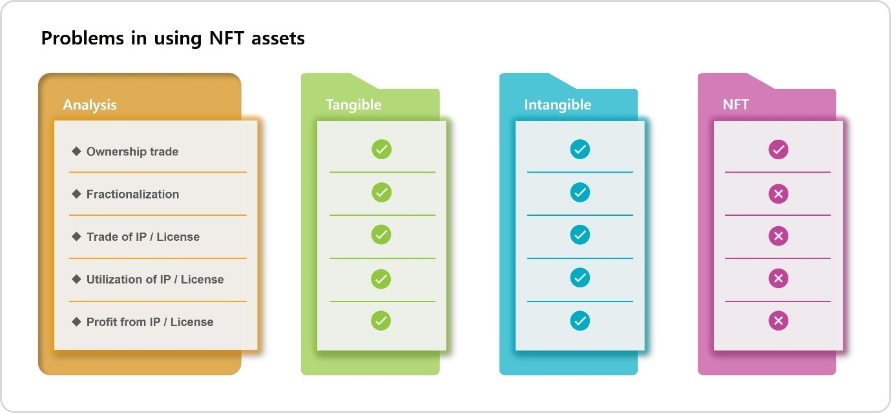

# 4. NFT 컨텐츠의 사용과 수익

아직까지 NFT 시장은 초기 단계로서, 대부분 단순한 이미지를 활용한 아이템으로 이루어져 있지만 다양한 비즈니스를 통한 새로운 컨텐츠가 대량 출현하게 될 것이다.

그러나 NFT는 소유권 증명을 할 뿐 일반 유형자산과 무형자산과 같이 소유권을 분할하여 판매할 수 없으며, 라이선스 판매, 대여, 사용, 수익에 관한 시스템이 전무하다. 즉, 아무리 다양한 NFT가 만들어져도 소유권 분할이나 라이선스의 문제가 해결되지 않는 한 소유권 증명만 가능할 뿐 수익 창출과 배분이 쉽지 않아 문제점이 발생한다.

예를 들어 Sound라는 카테고리 내에는 여러 사람이 들을 수 있는 노래, 영상 등에 배경음악으로 활용되는 BGM, 다양한 소리를 활용하는 Effect Sound 등 수많은 소리가 있는데, 이를 NFT화 한다면 한사람만 사용이 가능해진다.

그렇다면 많은 유저가 활용할 수 있는 분야의 Sound, Video, Image, Document 등의 창작물을 NFT로 만들려는 사람은 없을 것이고, NFT 시장은 여전히 수집과, 예술작품, 게임아이템 등의 기존 컨텐츠에서 벗어나지 못할 것이다.

만일 단순히 보유나 판매만 하는 것 외에 일반 유저가 NFT를 구매하는 것이 아닌 구매금액보다 훨씬 저렴한 비용으로 이용해 볼 수 있는 기회를 통해 그 가치를 확인할 수 있는 환경이 만들어진다면, 창작자 입장에서는 굳이 소유권이나 저작권을 판매하지 않아도 라이선스 사용권에 대한 수익을 얻을 수 있을 것이다. 또한, 얼마나 많은 유저가 사용했는지에 대한 기록을 일반유저에게 보여준다면, NFT 라이선스 수익의 가치를 쉽게 판단할 수 있을 것이며 아울러 소유권의 가치까지 쉽게 판단할 수 있을 것이다.

또한 수익가치를 얻을 수 있는 NFT라면 많은 유저가 그 NFT를 구매하여 사용수익을 얻고 싶어 할 것이고, 창작자 입장에서는 사용수익의 지분을 나누어 받을 수 있게 NFT의 소유권을 분할하여 일정 지분을 판매하는 새로운 시장구조도 가능해진다.

이러한 라이선스를 안정적으로 유지하기 위해서는 각 국가별 저작권 등록과 관련된 법률과 이를 운영하는 해당기관 등의 연계도 필요하지만, 대다수의 개인창작물은 저작권 등록을 하지 않아도 일반회사 또는 신탁회사와의 계약을 통해 소유권과 사용권을 관리하고 수익을 얻을 수 있다.

이렇게 기존 NFT 시장의 단순한 판매방식에서 벗어나 라이선스 사용권을 추가하는 것만으로 NFT 시장은 지금과는 다르게 더욱 발전할 수 있으며, 이를 통해 더욱 다양한 NFT 시장의 생태계가 활성화될 것이다.

&#x20;
