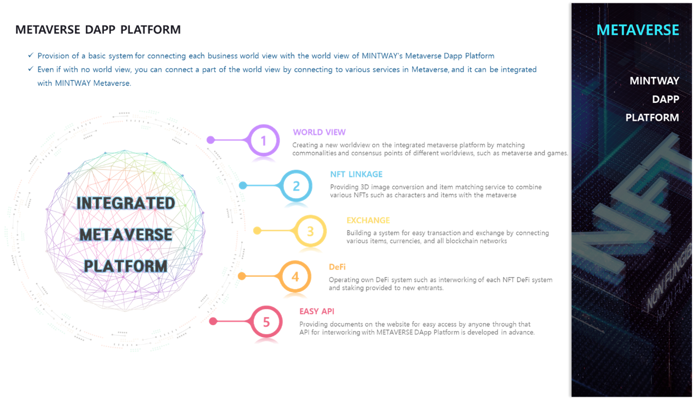

# 1. METAVERSE DApp Platform

METAVERSE Dapp Platform is a metaverse worldview that is linked to games to be developed by MINTWAY in the future as well as is a metaverse of a new concept that can be combined with various platforms such as external metaverses, games, and art platforms.

Even a simple game without a world view can be linked through the API provided by the METAVERSE Dapp Platform to share the world view, and transactions and exchanges such as characters, items, and game money are possible. In addition, through the sharing of various services such as DeFi, exchange, and cryptocurrency provided by Metaverse, users can more easily flow through a worldview that is organically connected to each other rather than a single worldview, and various marketing can be developed through the MINTWAY Portal.

Because the shared worldview and any digitally created product can be converted to NFT, and various currencies of each platform can be traded, the value of any product will be dramatically increased for any business.

As such, the METAVERSE DApp Platform will be the first METAVERSE to integrate and service all business platforms rather than a simple metaverse.
