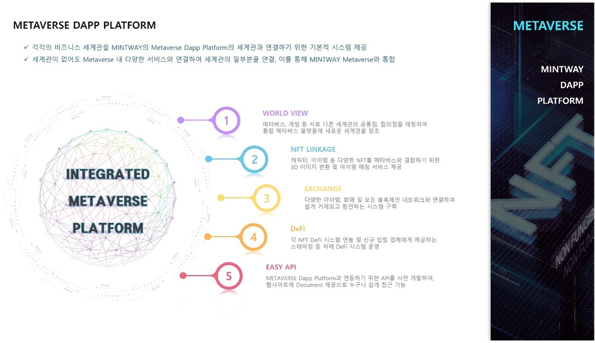

# 1. METAVERSE DApp Platform

<figure><figcaption>
Figure 23. METAVERSE Dapp Platform
</figcaption></figure>

METAVERSE Dapp Platform은 MINTWAY에서 향후 개발할 게임과 연계되는 메타버스 세계관이면서 외부의 메타버스, 게임, 아트 플랫폼 등 다양한 플랫폼과 결합이 가능한 새로운 개념의 메타버스다.

세계관이 없는 단순한 게임이라도 METAVERSE Dapp Platform에서 제공하는 API를 통해연동하여 세계관을 공유할 수 있으며, 케릭터, 아이템, 게임화폐 등 거래 및 교환이 가능하다. 또한 메타버스에서 제공하는 DeFi, 거래소, 암호화폐 등 다양한 서비스 공유를 통해 하나의 세계관이 아닌 상호 유기적으로 연결되는 세계관을 통해 유저의 유입을 보다 쉽게 할 수 있으며, MINTWAY Portal을 통해 다양한 마케팅을 전개할 수 있다.

이러한 세계관 공유와 디지털로 만들어진 어떠한 상품이라도 NFT로 변환 가능하며, 각 플랫폼의 다양한 화폐를 거래할 수 있기 때문에, 어떤 비즈니스라 할지라도 상품의 가치가 비약적으로 높아질 수 있을 것이다.

이처럼 METAVERSE Dapp Platform은 단순한 메타버스가 아닌 모든 비즈니스 플랫폼을 통합하여 서비스하는 최초의 METAVERSE가 될 것이다.
