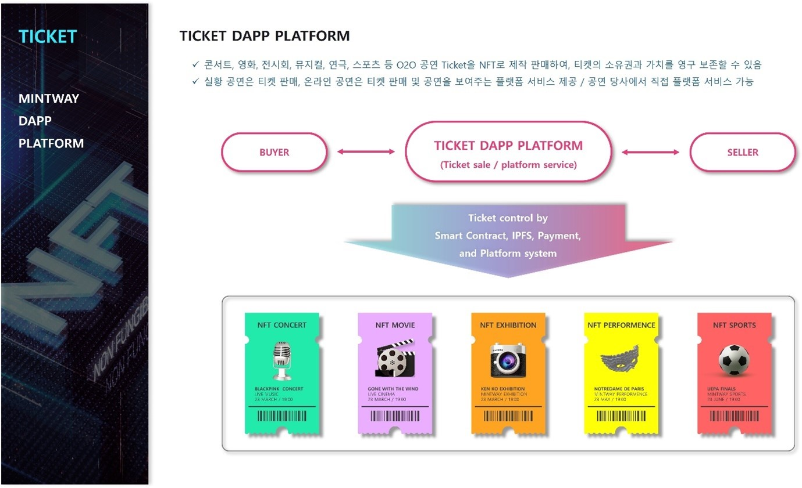

# 2. TICKET Dapp Platform

<figure><figcaption></figcaption></figure>

TICKET Dapp platform은 콘서트, 영화, 전시회, 뮤지컬 등 O2O 공연 티켓을 NFT로 제작판매할 수 있다.

실황공연은 티켓판매를 NFT로 제작하여 판매할 수 있고, 온라인 공연은 티켓판매와 공연을 보여주는 플랫폼 서비스를 제공한다. 물론 플랫폼을 가지고 있는 업체는 자체적으로 서비스할 수도 있다.

TICKET NFT제작은 플랫폼에서 제공하는 대시보드에서 날짜와 시간, 티켓 수, 공연정보, 티켓 이미지 등을 입력하고, 민팅 시 스마트컨트랙트 및 원하는 토큰 블록체인 네트워크 선택 등 간단한 정보만 입력하면 즉시 발행된다.

티켓수량은 100장 이상 유저가 원하는 대로 만들 수 있으며, 선택하는 블록체인 네트워크 gas비용과 티켓제작 수수료가 포함된다. 그러나 일반 TICKET 플랫폼에 비해 저렴하다.

이후 Ticket NFT는 자동으로 MINTWAY Market에 등록되며, 자체 플랫폼에서 판매 가능하다.
