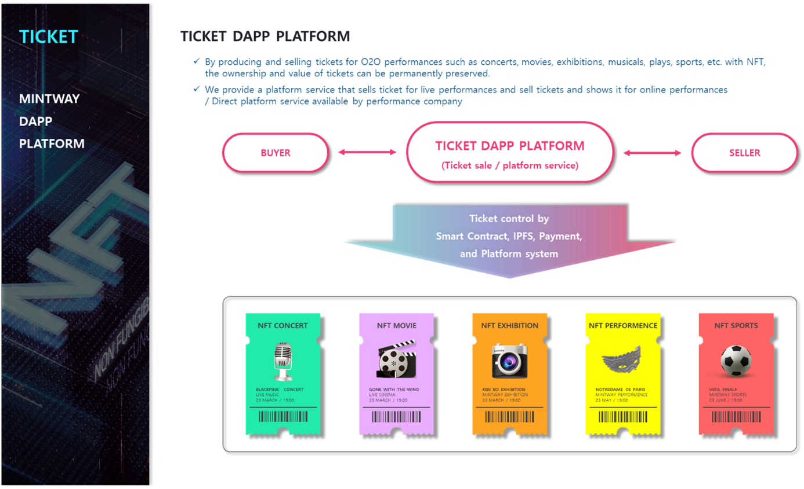

# 2. TICKET Dapp Platform

The TICKET DApp platform can produce and sell NFT tickets for O2O performances such as concerts, movies, exhibitions, and musicals.

For live performances, ticket sales can be produced and sold through NFT, while online performances provide a platform service that sells ticket and shows performances. Of course, companies that have a platform can also provide services on their own.

The issue of TICKET NFTs is issued immediately by entering the date and time, number of tickets, performance information, ticket image, etc. on the dashboard provided by the platform, and entering simple information such as smart contract and desired token blockchain network during minting.

The number of tickets can be created  (more than 100) as desired by the user, and the Tx fee and ticket production fee of the selected blockchain network are included. However, it will be cheaper than the general TICKET platform.

After that, Ticket NFT is automatically registered in MINTWAY Market and can be sold on its own platform.
