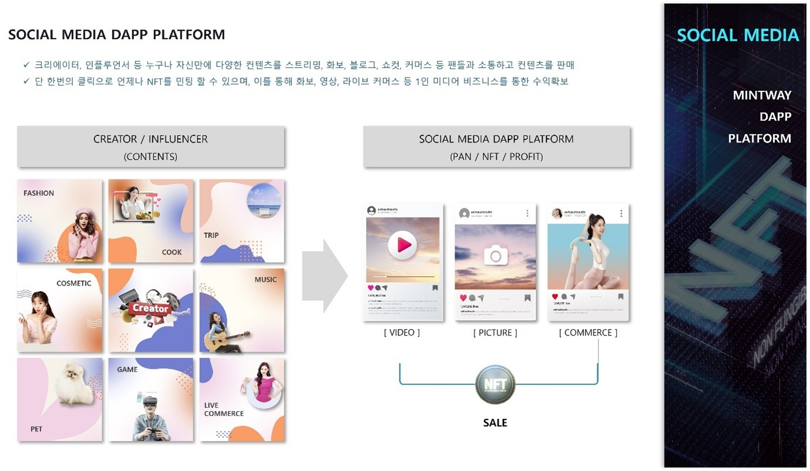

# 3. SOCIAL MEDIA Dapp Platform

<figure><figcaption>
Figure 25. SOCAIL MEDIA Dapp Platform
</figcaption></figure>

SOCIAL MEDIA DAPP PLATFORM은 블로그, 인스타그램, 유튜브, 홈쇼핑을 통합한 개념으로 크리에이터가 회원가입을 하면 자신의 플랫폼이 생성된다.

플랫폼은 공개형 블로그, 이미지 컨텐츠, 스트리밍 서비스, 주문형 콘텐츠 서비스 등 4개의 서비스로 이루어져 있으며, 크리에이터는 패션, 요리, 여행, 화장품, 음악, 반려동물, 게임 등 원하는 컨텐츠를 생성하고 보여줄 수 있으며 각 컨텐츠를 판매할 수 있다.

이때 자신만의 사진, 화보, 영상 등을 단 한 번의 클릭으로 언제나 NFT를 민팅할 수 있으며, 이를 통해 화보, 영상 및 디지털로 이루어진 상품을 라이브 커머스를 통해 판매할 수도 있다.

일반 컨텐츠도 판매하고, NFT로 제작하여 한정적인 수량을 판매할 수도 있으며, 회원에 따른 월 구독이나, 유저가 요청하는 영상 및 이미지를 제작하여 판매하는 등 기존 소셜미디어의 한정적인 수익이 아닌 본인의 컨텐츠에 따라 다양한 수익을 얻을 수 있는 시스템이다.

결제방법은 현금, 카드, 암호화폐 등 크리에이터가 선택한대로 가능하며, 유튜브 등 다른미디어 매체와 동시에 송출도 유저의 선택이기 때문에 편리하게 사용할 수 있다.
