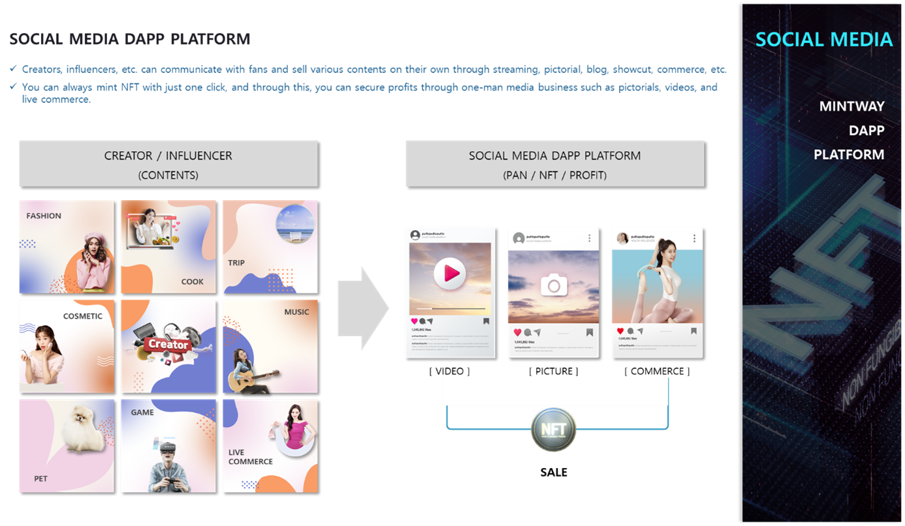

# 3. SOCIAL MEDIA Dapp Platform

SOCIAL MEDIA DAPP PLATFORM is a concept that integrates blog, Instagram, YouTube, and home shopping, and when creators sign up for membership, their own platform is created.

The platform consists of four services: open blog, image content, streaming service, and on-demand content service. Creators can create and show desired content such as fashion, cuisine, travel, cosmetics, music, companion animals, and games, etc. and can sell them.

At this time, users can always mint their own pictures, photo book, videos, etc. with just one click, and can sell pictures, videos, and digital products through live commerce.

Users can also sell general content and sell it in NFTs of a limited quantity, and it is a system that can earn various profits depending on their own content but not the limited income of existing social media such as monthly subscriptions by each member, creation and sales of videos or images requested by users, etc.

The payment method can be selected by the creator, such as cash, card, cryptocurrency, etc., and it can be conveniently used because it is the user's choice to broadcast simultaneously with other media such as YouTube.
