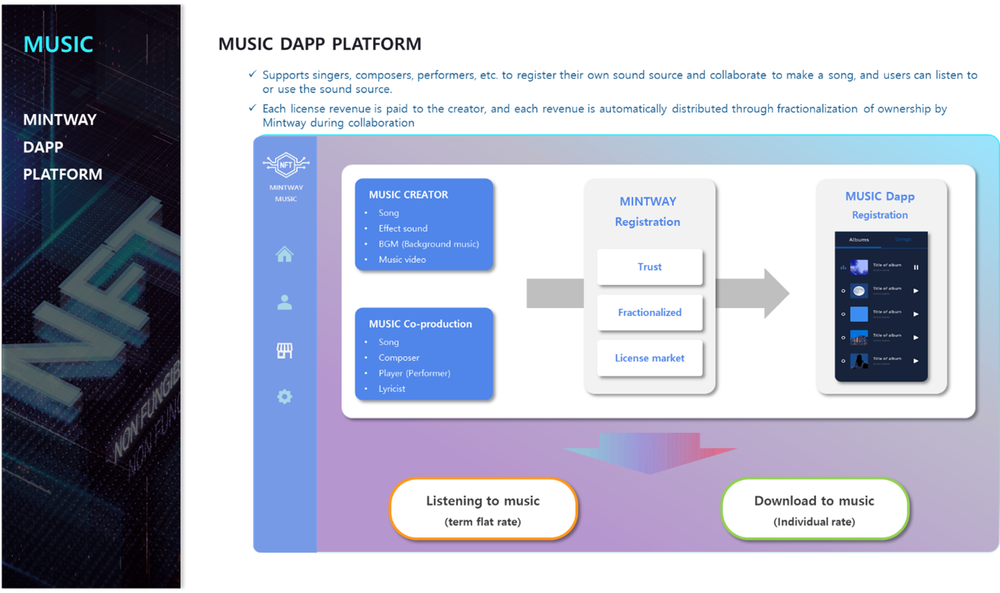

# 4. MUSIC Dapp Platform

In MUSIC DAPP PLATFORM, creators such as singers, composers, and performers can register their own sound source and divide the ownership to sell it, and general users can listen to music as if they were listening to music on an existing music platform.

Each license revenue is paid to the creator, and when ownership is fractionalized, the revenue is distributed according to the share of each owner.

It is also possible to distribute shares of ownership through collaboration among musicians who make music. For example, when a composer wants to add singers and guitars after making a basic sound source, if he signs up in the Co-production of MUSIC DAPP PLATFORM and registers the fact that he is looking for singers and guitars, each musician listens to the sound source and records the corresponding song and guitar performance and upload it. The first registered composer selects the best musician from among the posted contents and distributes the stake to the entire music ownership.

Proceeds from the license of this music will also be distributed according to each stake. At this time, all ownership stake means the right to beneficiary, and the copyright is owned by each musician.

