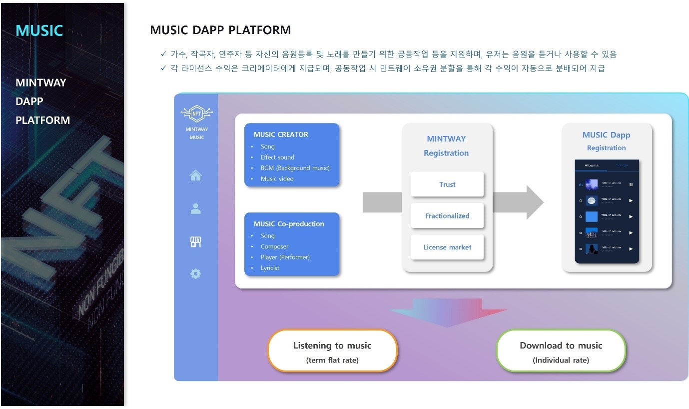

# 4. MUSIC Dapp Platform

<figure><figcaption>
Figure 26. MUSIC Dapp Platform
</figcaption></figure>

MUSIC DAPP PLATFORM은 가수, 작곡자, 연주자 등 크리에이터가 자신의 음원을 등록하여 소유권을 분할하여 판매할 수 있으며, 일반 유저가 뮤직 플랫폼에서 음악을 듣는 것처럼 들을 수도 있다.

각 라이선스 수익은 크리에이터에게 지급되며, 소유권 분할 시 각 소유권자의 지분대로 수익을 배분한다.

또한 음악을 만드는 뮤지션끼리 공동작업을 통해 소유권에 대한 지분을 분배할 수도 있다. 예를 들어 작곡자가 기본적인 음원을 제작 후 가수와 기타를 추가하고자 할 때 MUSIC DAPP PLATFORM - Co production에 등록하여 가수와 기타를 구한다고 올리면, 각 뮤지션이 음원을 듣고 그에 맞는 노래와 기타를 연주하여 올리게 된다. 이렇게 올려진 내용 중 최초 등록한 작곡자가 가장 좋은 뮤지션을 선택하여 전체 음악 소유권에 지분을 분배하는 것이다.

역시 이 음악의 라이선스 수익은 각 지분대로 분배하게 된다. 이때 모든 소유권 지분은 수익권을 의미하여 저작권은 각 뮤지션이 갖게 된다.

