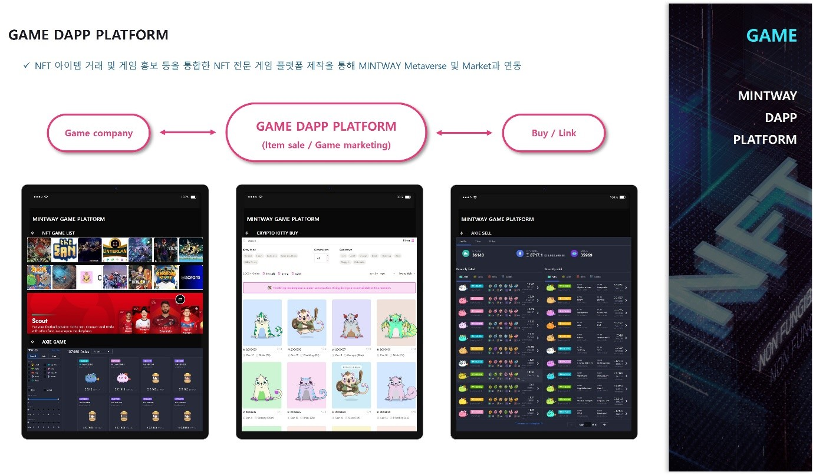

# 5. GAME Dapp Platform

<figure><figcaption>
Figure 27. GAME Dapp Platform
</figcaption></figure>

GAME DAPP PLATFORM은 MINTWAY에서 기획하고 직접 개발하려는 게임 플랫폼과 타게임회사의 아이템 판매 및 마케팅을 지원하는 플랫폼 2개로 나눠진다.

첫째 MINTWAY에서 기획하고 있는 게임은 중세에서 근세로 넘어가는 역사의 한페이지를 장식한 대항해시대를 배경으로 하는 “New World”와 우주를 배경으로 행성개척 및 무역, 성간 전쟁을 테마로 할 “Legend of Galaxy”다.

이 게임들은 METAVERSE Dapp platform과 연계되는 세계관으로 기획되고 있으며, 이외에DeFi로 사용될 미니게임, 캐쥬얼게임도 개발 중에 있다.

둘째 게임회사의 아이템 판매 및 마케팅을 지원하는 플랫폼은 MINTWAY LICENSE MARKET과 연동하여 게임아이템을 판매하고 거래하는 플랫폼으로 개발 예정이나 차후에는 METAVERSE Dapp platform과 통합할 예정이다.
