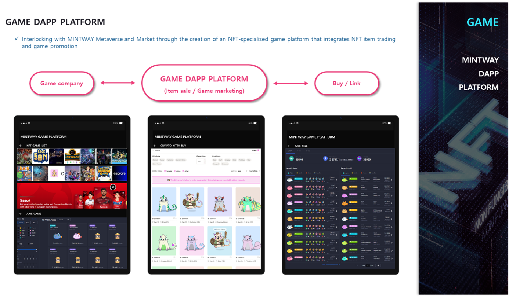

# 5. GAME Dapp Platform

GAME DAPP PLATFORM is divided into two platforms: a game platform planned and developed by MINTWAY, and a platform that supports item sales and marketing of other game companies.

First, the game planned by MINTWAY is “New World”, which is set in the Age of Discovery, which decorated one page of history from the Middle Ages to the modern era, and “Legend of Galaxy”.

These games are being planned with a worldview linked to the METAVERSE Dapp platform, and mini-games and casual games to be used as DeFi are also under development.

Second, the platform that supports the game company's item sales and marketing will be developed as a platform to sell and trade game items in conjunction with MINTWAY LICENSE MARKET, but will be integrated with the METAVERSE Dapp platform in the future.

