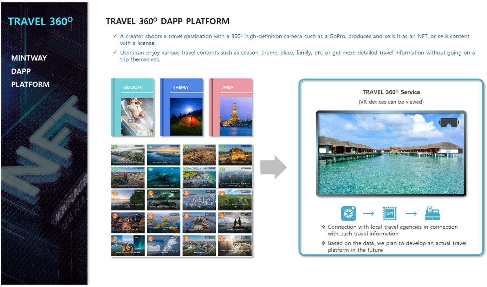

# 6. TRAVEL 360O Dapp Platform

TRAVEL 360O Dapp Platform is a platform that allows creators to capture travel destinations with 360O high-definition cameras such as GoPro and produce them with NFT to earn sales and license revenue.

Users can enjoy various travel contents according to the category, such as season, theme, place, family, etc., or plan a trip after acquiring more detailed travel information without having to travel directly.

Such information, which is difficult to obtain accurate information such as accommodation, food, and leisure, can be easily delivered to general users, and by converting this information into data, the products that travelers want are matched with a package or a single product and sold through NFT.

