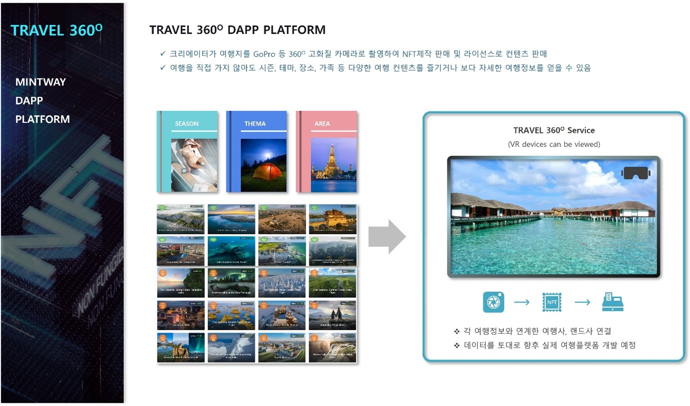

# 6. TRAVEL 360º Dapp Platform

<figure><figcaption>
Figure 28. TRAVEL 360º Dapp Platform
</figcaption></figure>

TRAVEL 360O Dapp Platform은 크리에이터가 여행지를 GoPro 등 360O 고화질 카메라로 촬영하여 NFT로 제작하여 판매 및 라이선스 수익을 얻을 수 있는 플랫폼이다.

유저는 여행을 직접가지 않아도 시즌, 테마, 장소, 가족 등 카테코리에 따라 다양한 여행컨텐츠를 즐기거나 보다 자세한 여행정보를 취득 후 여행계획을 잡을 수 있다.

숙소, 음식, 레저 등 정확한 정보를 얻기 어려운 이러한 정보를 일반 유저에게 쉽게 전달할 수 있으며, 이러한 정보를 데이터화 하여 차후 여행자가 원하는 상품을 패키지 또는 단일 상품으로 매칭하여 NFT로 판매할 예정이다.

