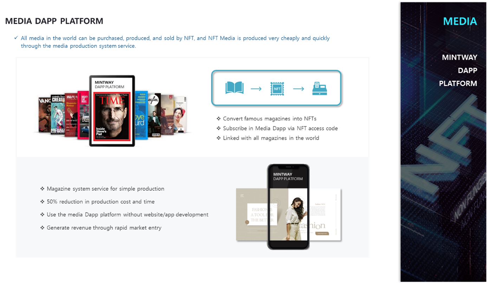

# 7. MEDIA DAPP PLATFORM

The MEDIA Dapp Platform can purchase and sell world-famous media magazines with NFT, and it can publish magazines and news quickly and inexpensively through media production system services.

NFT buyers can directly view media through the NFT access code on the MEDIA Dapp Platform, and MINTWAY plans to sell media through contracts with world-famous media companies.

Ordinary users can look a lot of these media through a single purchase or a flat rate, and companies that want to start a media business can use the MEDIA Dapp Platform to service users without developing a website or app by a magazine production system.

In addition, users can produce and sell old articles, photos, and historical records from global famous magazines using NFT, and reporters or media companies can register one NFT with their own articles for almost all themes such as finance, fashion, IT, current affairs, music, politics, and society, etc. through system provided.
