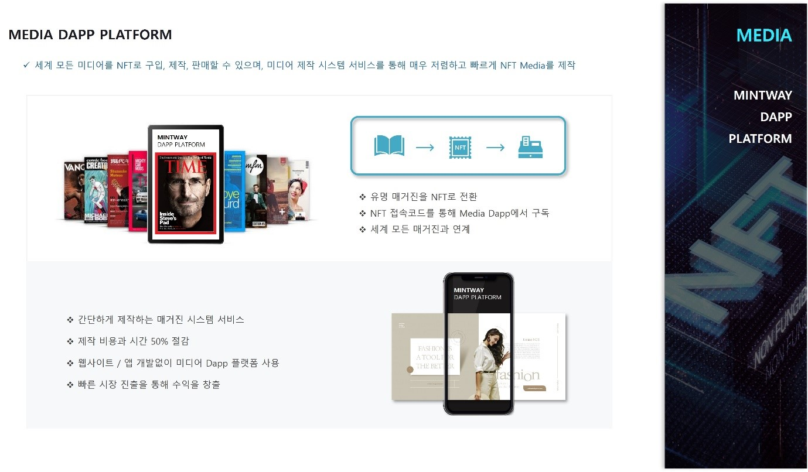

# 7. MEDIA DAPP PLATFORM

<figure><figcaption>
Figure 29. MEDIA Dapp Platform
</figcaption></figure>

MEDIA Dapp Platform은 세계 유명 미디어 잡지를 NFT로 구입, 판매할 수 있으며, 미디어 제작 시스템 서비스를 통해 저렴하고 빠르게 잡지, 뉴스 등을 NFT로 발행할 수 있다.

NFT 구매자는 MEDIA Dapp Platform에서 NFT접속코드를 통해 직접 미디어를 볼 수 있으며, MINTWAY에서는 세계 유명 미디어사와 계약을 통해 판매 대행할 예정이다.

일반 유저는 이러한 미디어를 단일구매 또는 정액제를 통해 많은 미디어를 볼 수 있으며, 미디어 비즈니스를 시작하려는 기업에게는 매거진 제작 시스템을 제공하여, 웹사이트 및 앱개발 없이도 MEDIA Dapp Platform을 이용하여 유저에게 서비스할 수 있다.

또한 글로벌 유명 매거진의 예전 기사 및 사진, 역사 기록 등을 NFT로 제작하여 판매하고, 기자 및 언론사 등 금융, 패션, IT, 시사, 음악, 정치, 사회 등 거의 모든 테마를 대상으로 자신이 제작한 기사를 하나의 NFT로 등록할 수 있는 시스템을 제공한다.
