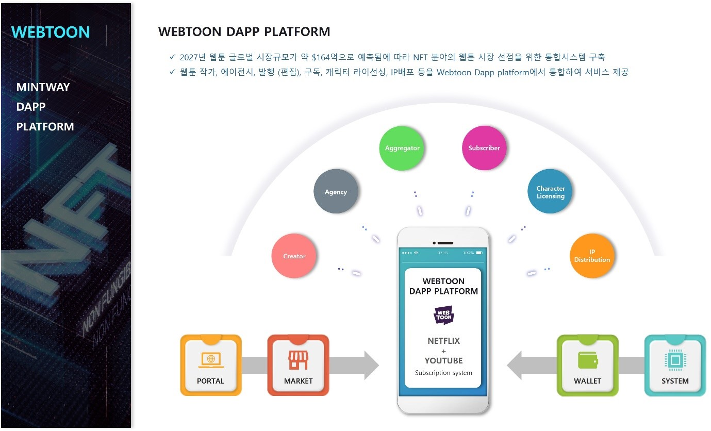

# 8. WEBTOON DAPP PLATFORM

<figure><figcaption>
Figure 30. WEBTOON Dapp Platform
</figcaption></figure>

WEBTOON의 글로벌 시장규모가 약 $165억으로 예측됨에 따라 NFT 분야의 웹툰 시장 선점을 위한 통합시스템을 구축하기 위해 WEBTOON DAPP PLATFORM을 만들 예정이다.

만화시장은 예전 코믹스, 마블, 만화잡지 등 지면에서 온라인 플랫폼으로 전환되고 있으며, 특히 KOREA의 웹툰 플랫폼은 전세계에서 매우 커다란 시장을 차지하고 있다.

웹툰은 단순한 만화작가가 자신의 만화를 온라인에 올리는 것이 아닌, 크리에이터, 에이전시, 발행, 캐릭터 라이선싱, IP 배포, 구독을 위한 마케팅 등 전문적인 분야들이 있다.

우리가 개발하려는 WEBTOON DAPP PLATFORM은 유저가 다양한 웹툰을 보는 서비스를 함과 동시에 각 웹툰의 IP, 캐릭터 라이센싱 등을 신탁회사에서 관리할 수 있고, 에이전시 역할을 대행할 예정이다.

NFT로 제작한 웹툰은 작가가 원하는 대로 회, 권, 멤버십 등을 다양한 상품을 만들고 완본 NFT는 대량으로 민팅하여 판매하거나 특별 애디션으로 만들어 별도 판매할 예정이다.
