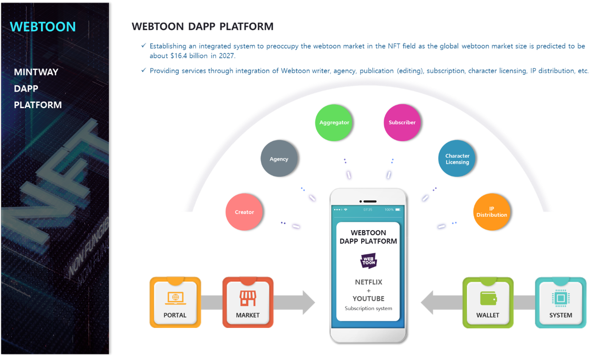

# 8. WEBTOON DAPP PLATFORM

As the global market size of WEBTOON is predicted to be about $16.5 billion, WEBTOON DAPP PLATFORM will be created to establish an integrated system for preoccupying the webtoon market in the NFT field.

The comics market is shifting from the old comics, Marvel, and comic magazines to online platforms.

Webtoons don't mean just for cartoonists to upload their own cartoons online, but the combination of specialized fields such as creators, agencies, publication, character licensing, IP distribution, and marketing for subscriptions.

The WEBTOON DAPP PLATFORM we plan to develop provides a service for users to view various webtoons, and at the same time, the trust company can manage the IP and character licensing of each webtoon, and will act as an agency.

Webtoons produced with NFTs will be made into various products such as episodes, volumes, and memberships according to the author's wishes, and the complete NFT will be minted and sold in bulk or sold separately as a special edition.
