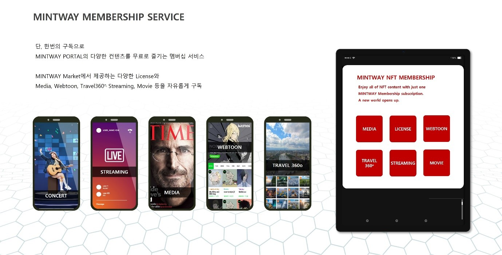

# 9. MINTWAY Membership service

<figure><figcaption>
Figure 31. MINTWAY Membership service
</figcaption></figure>

MINTWAY는 라이선스 마켓과 Dapp platform을 통해 모인 수많은 NFT를 적은 비용으로편리하게 이용할 수 있는 멤버십 서비스를 제공한다.

라이선스 마켓은 유저가 민팅 후 라이선스 마켓에 등록한 NFT를 연단위 멤버십 서비스사용권을 구매하여 이용할 수 있으며, 등급 및 범위(이미지, 영상, 캐릭터 등)에 따라 가격에 차이가 있다.

MINTWAY Dapp platform은 콘서트, 스트리밍, 미디어, 웹툰, Travel 360O 등 유저가 즐기고 쉽게 볼 수 있는 서비스를 대상으로 멤버십 서비스를 제공한다.

이때 이용할 수 있는 NFT는 NFT 소유자가 멤버십 서비스를 하기 위한 동의를 해야 하며, 동의하지 않은 NFT는 노출되지 않는다.

멤버십 서비스를 통해 발생된 수익은 전체 수익에 대해 일정 수수료를 제외하고 클릭율과 등급에 따라 NFT 소유자에게 자동 분배된다.

이를 통해 MINTWAY Portal은 NFT 수익을 얻고자 하는 모든 사람이 스스로 찾아올 수 있으며, 대단위 NFT를 사용할 수 있는 세계 최초의 NFT Portal이 될 것이다.
