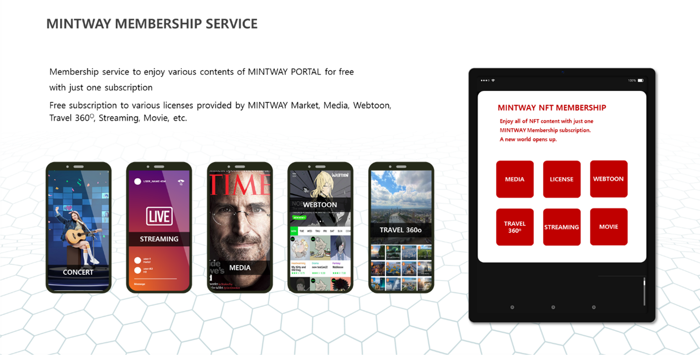

# 9. MINTWAY Membership service

MINTWAY provides a membership service that allows you to conveniently use the numerous NFTs gathered through the license market and Dapp platform at a low cost.

In the license market, users can use the NFT registered in the license market after minting by purchasing an annual membership service license, and the price varies according to the grade and scope (image, video, character, etc.).

The MINTWAY Dapp platform provides membership services for services that users can enjoy and easily view, such as concerts, streaming, media, webtoons, and Travel 360O.

In this case, the NFT that can be used requires the NFT owner to consent to membership service, and NFTs that do not agree are not exposed.

The revenue generated through the membership service is automatically distributed to the NFT owner according to the click-through rate and grade, excluding a certain fee from the total revenue.

Through this, MINTWAY Portal will be the first NFT Portal in the world where anyone who wants to earn NFT profits can come and use large-scale NFT.
