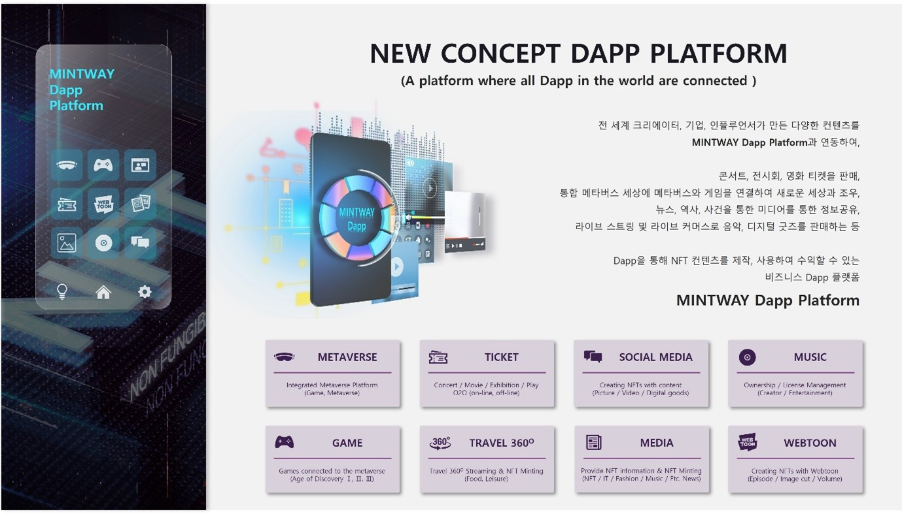

# Ⅴ. MINTWAY DAPP PLATFORM

<figure><figcaption>
Figure 21. MINTWAY Dapp Platform
</figcaption></figure>

MINTWAY Dapp플랫폼은 NFT 관련하여 전 세계에서 수많은 유저가 자신의 컨텐츠를 올려서 수익을 얻을 수 있는 개념으로 메타버스, 게임, 소셜 미디어, 티켓, 여행, 웹툰 등 다양한 플랫폼을 Dapp화 한 것이다.

MINTWAY마켓의 라이선스가 자신의 NFT사용권을 유저에게 판매하는 것이라면, MINTWAY는 비즈니스 구조, 서비스 방식 등에 따라 자신의 컨텐츠를 유저에게 제공하여 수익을 얻는 방식이다. 즉, 자신의 컨텐츠가 좋을수록 더 많은 유저에게서 수익을 얻을 수 있다.

기본적인 Dapp은 MINTWAY에서 제공하며 이후 추가적인 Dapp을 지속적으로 개발하여 서비스할 예정이며, 향후 개인 또는 회사가 MINTWAY에 Dapp을 등록할 수 있는 시스템도 구축할 예정이다.

MINTWAY Dapp Platform은 NFT관련 지식 및 기술의 한계로 NFT비즈니스에 쉽게 접근할 수 없었던 부분을 해결하는 4개의 시스템을 지원하고 있다.

첫째, Smart Minting으로 각 Dapp에서 생성된 컨텐츠를 원클릭으로 민팅할 수 있으며, 유저가 소유권 분할 및 라이선스 마켓에 직접 등록할 수 있다.

둘째, MINTWAY Wallet과 통합되어 유저가 직접 NFT를 관리할 수 있다.

셋째, Easy Customize 시스템을 통해 메타버스, 게임, 아트 플랫폼 등 MINTWAY METAVERSE Dapp platform과 API로 쉽게 연동할 수 있다.

넷째, MINTWAY Dapp platform은 유저가 제작한 일반 컨텐츠, 민팅한 NFT 등 다양한 상품을 현금, 카드, 암호화폐 등 선택하여 결제할 수 있다.

이를 통해 누구나 쉽게 NFT를 제작 관리할 수 있는 MINTWAY Dapp platform을 이용할 수 있다.

우리는 최초 8개의 Dapp platform을 순차적으로 서비스할 예정이며, 이후 시장상황과 시대적 기술발전에 따라 추가적인 Dapp platform을 개발할 것이다.
