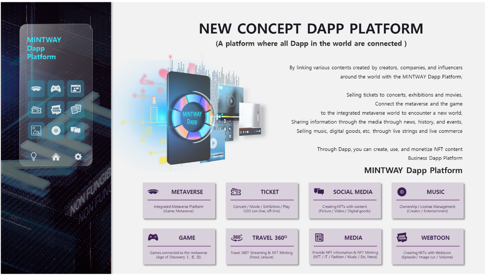
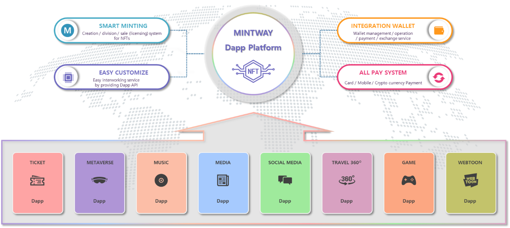

# Ⅴ. MINTWAY DAPP PLATFORM

The MINTWAY DApp platform is a concept where numerous users from all over the world can earn profits by uploading their own content related to NFT, and it is the DApped of various platforms such as media, tickets, travel, webtoons, and digital goods.

If the license of the MINTWAY market is to sell one's own NFT license to users, MINTWAY is a method of earning profits by providing its content to users according to the business structure and service method. In other words, the better your content, the more revenue you can get from users.

The basic DApps are provided by MINTWAY, and additional DApps will be continuously developed and serviced in the future.

MINTWAY Dapp Platform supports four systems that solve problems that could not be easily accessed in NFT business due to limitations in NFT-related knowledge and technology.

First, through Smart Minting, content created in each Dapp can be mined with one click, and users can fractionalize ownership and directly register them on license market.

Second, it is integrated with MINTWAY Wallet, allowing users to directly manage NFTs.

Third, through the Easy Customize system, MINTWAY METAVERSE Dapp platform such as metaverse, game, and art platform can be easily linked by API.

Fourth, the MINTWAY DApp platform allows users to select and pay such as with cash, card, and cryptocurrency for various products such as general contents and minted NFTs by users.

Through this, anyone can use the MINTWAY DApp platform, where anyone can easily create and manage NFTs.

We plan to service 8 DApp platforms sequentially in the beginning, and then we will develop additional DApp platforms according to market conditions and technological development of the times.
