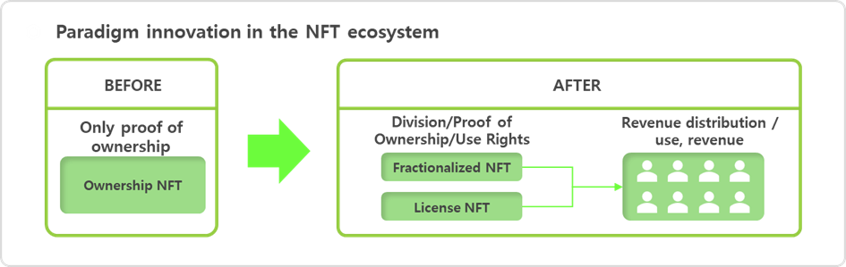
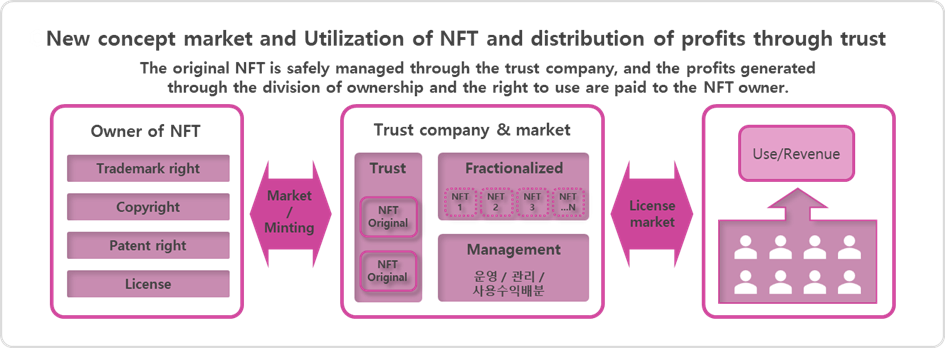
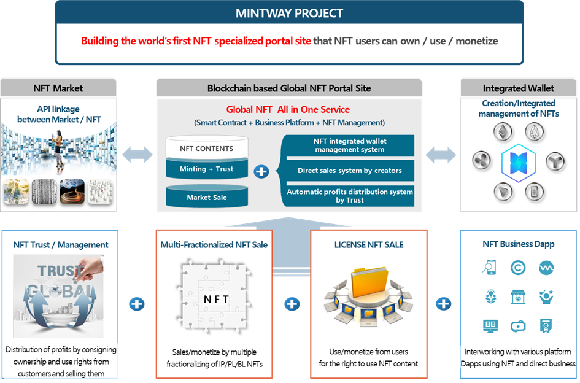

# Ⅲ. MINTWAY PROJECT

In order to solve these problems and present a new paradigm to the NFT ecosystem, we would like to present a new concept outside the existing structure.

If the existing NFT was only able to prove ownership, now it is possible to split the ownership of the NFT and sell it as a license at a low price, creating a market where anyone who owns NFT can use and make a profit, and this will mark a landmark turning point in the NFT ecosystem and business model.

For this, a trust company that will store, manage, and operate users' original NFTs and perform revenue distribution is essential and a wallet that can move NFTs in various blockchain networks and can easily be managed by individuals and check profits should be supported.

“The only market to fractionalize ownership and sell licenses”

“The only system that manages NFTs through trusts”

“The only platform where you can use/profit all NFTs”

“The only wallet that can use any blockchain network that creates NFTs”

&#x20;

Through these new concepts and systems, we intend to pioneer a new market that does not compete with the existing market.

Therefore we

First, by creating an NFT portal site that collects NFT markets and various NFT business projects in one place regardless of country, language, or blockchain network (mainnet),

Second, even in different blockchain networks, we develop a new system and wallet that manages them in an integrated way so that mutually organic transactions are possible,

Third, through the development of an NFT license market where you can earn profits from usage rights by utilizing all NFT licenses beyond simple transactions on the ownership of NFTs,

Fourth, by dividing the NFT into multiple divisions, it is possible to trade the ownership interest in the right of use income,

Fifth, by linking various Dapps within the NFT portal to allow creators to own, use, and profit from NFTs, we want to break free from the limitations of the existing NFT business model and open up a new NFT market.

#### “We call this project the MINTWAY Project.”

\
&#x20;To this end, we will proceed with the project with the goal of developing a global NFT portal site that connects numerous NFT markets, developing an NFT market that can own, use, and profit from NFTs, and establishing a trust company that can manage, operate, and distribute NFTs in the NFT market, establishing a cryptocurrency foundation that can trade all these profits, developing a platform where various Dapps can gather to utilize these services, and developing Dapps that are directly operated.

Accordingly, we will provide a completely new and special service in the global NFT market by proposing a model of a basic concept that anyone can create, divide, and use to generate revenue, and commercialize it.
