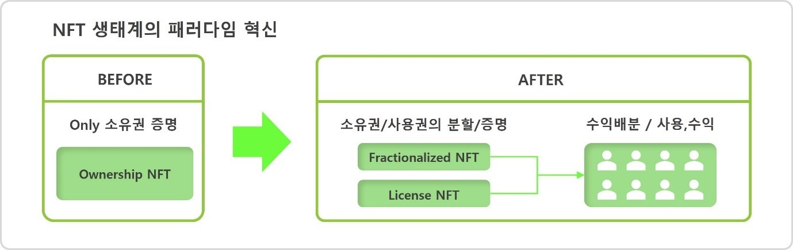
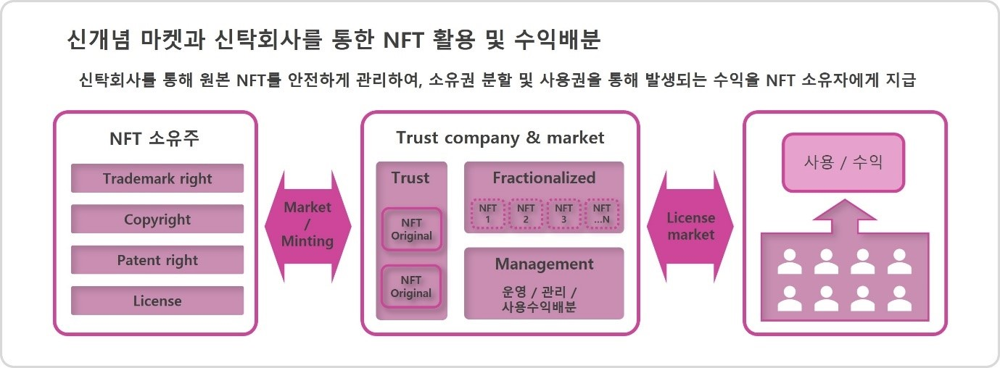
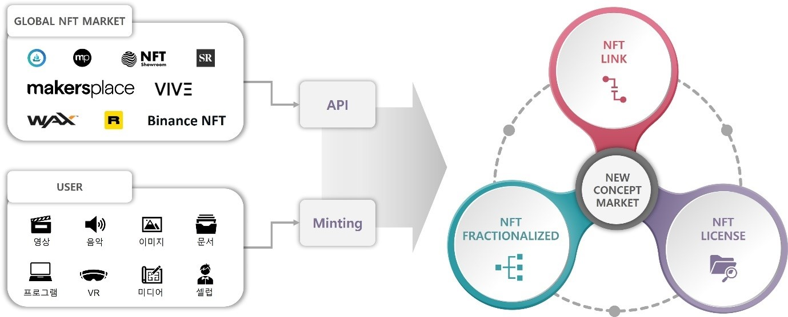

# Ⅲ. MINTWAY 프로젝트

우리는 이러한 문제점들을 해결하고 NFT 생태계에 새로운 페러다임을 제시하기 위해 기존 구조에서 벗어나 새로운 개념을 제시하고자 한다.

<figure><figcaption>
Figure 7. NFT 생태계의 패러다임 혁신
</figcaption></figure>

기존의 NFT가 단순한 소유권 증명만 가능했다면, 이제부터는 NFT 소유권 분할이 가능하고, 라이선스로 저렴하게 판매하여 NFT를 보유한 누구라도 사용, 수익이 가능한 마켓을 만들어, 이를 통해 NFT 생태계 및 비즈니스 모델의 획기적인 전환점을 맞이하게 될 것이다.

<figure><figcaption>
Figure 8. 신개념 마켓과 신탁회사를 통한 NFT 활용 및 수익배분
</figcaption></figure>

이를 위해서는 유저의 원본 NFT를 보관, 관리, 운영, 수익배분을 수행할 신탁회사가 필수적이며, 다양한 블록체인 네트워크의 NFT를 이동하고 개인이 쉽게 관리할 수 있으며, 수익을 확인할 수 있는 지갑이 지원되야 한다.

#### **“소유권 분할과 라이선스를 판매하는 유일한 마켓”**

#### **“신탁을 통해 NFT를 관리하는 유일한 시스템”**

#### **“모든 NFT를 사용/수익할 수 있는 유일한 플랫폼”**

#### **“NFT를 제작하는 모든 블록체인 네트워크를 사용할 수 있는 유일한 지갑”**

&#x20;

우리는 이러한 새로운 개념과 시스템을 통해 기존 마켓과 경쟁 없는 새로운 시장을 개척하고자 한다.

<figure><figcaption>
Figure 9 MINTWAY PROJECT
</figcaption></figure>

따라서 우리는

첫째, 국가, 언어, 블록체인 네트워크(메인넷)과 무관하게 NFT마켓과 다양한 NFT 비즈니스 프로젝트를 한곳으로 모으는 NFT포탈사이트를 제작하여,

둘째, 서로 다른 블록체인 네트워크라 할지라도 이를 통합적으로 관리하는 새로운 시스템 및 지갑을 개발하여 상호 유기적인 거래가 가능하도록 하고,

셋째, NFT 소유권에 대한 단순한 거래에서 벗어나 모든 NFT의 라이선스를 활용하여 사용권으로 수익을 얻을 수 있는 NFT 라이선스마켓 개발을 통해,

넷째, NFT를 다중 분할하여 사용권 수익에 대한 소유지분을 거래할 수 있도록 하며,

다섯째, NFT포탈내에 다양한 Dapp을 연계하여 창작자의 NFT를 소유, 사용, 수익하게 하므로써 기존의 NFT 비즈니스 모델의 한계에서 벗어나 새로운 NFT 시장을 개척하고자 한다.

### “우리는 이 프로젝트를 **MINTIVERSE Project**라 명명한다.”

이를 위해 우리는 수많은 NFT마켓을 연계하는 글로벌 NFT포탈사이트 개발과 NFT를 소유, 사용, 수익할 수 있는 NFT마켓 개발, NFT마켓에서 NFT를 관리, 운영, 수익 배분할 수 있는 Trust회사 설립, 이 모든 수익을 거래할 수 있는 암호화폐 파운데이션 설립, 이러한 서비스를 활용하기 위해 다양한 Dapp이 모일 수 있는 플랫폼 및 직접 운영하는 Dapp 개발을 목표로 프로젝트를 진행할 것이다.

이에 우리는 누구나 NFT를 만들고, 분할하고, 사용하여 수익을 창출할 수 있는 기본개념의 모델을 제시하고 이를 비즈니스화 하여 글로벌 NFT 시장에서 완전히 새롭고 특별한 서비스를 제공할 것이다.
