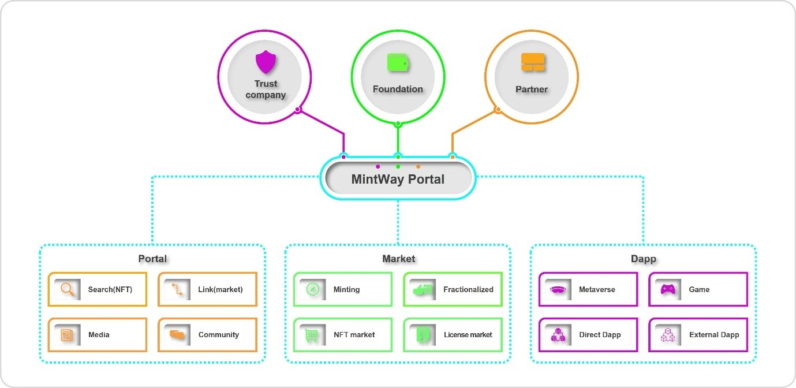

# 1. MINTWAY NFT Portal

우리가 만들려는 NFT포탈은 YAHOO와 같이 NFT와 관련된 정보, 뉴스, NFT마켓, NFT 상품 등을 한눈에 볼 수 있고, 검색하여 관련 정보를 찾을 수 있도록 다양한 정보를 NFT 유저들에게 제공하고자 하며, 모든 블록체인 네트워크를 하나로 관리할 수 있는 지갑을 개발하여 유저가 원하는 블록체인 네트워크에서 NFT를 제작할 수 있다.

특히 NFT마켓은 글로벌 NFT마켓을 연동하여 유저가 마켓 또는 NFT를 선택할 경우 링크되어 있는 해당 마켓으로 바로 이동하는 정보제공 마켓과, 소유권 다중분할 및 라이선스를 거래하고 사용하는 MINTWAY 마켓으로 서비스한다.

또한 Dapp Platform을 모아 놓아 유저가 사용할 수 있게 한 MINTWAY는 수많은 Dapp이 연결될 수 있도록 티켓(콘서트, 영화, 전시회), 소셜 미디어(개인방송, 음원, 화보, 영상), 여행(Travel 360o, 여행정보), 웹툰, 게임, 미디어 작품 등 각각의 플랫폼을 제작하여 NFT와 관련된 Dapp을 활용한 비즈니스를 한곳에 모아 서로 경쟁하고 마케팅 할 수 있는 공간과 같은 오픈마켓 형태로 제공한다.

이러한 플랫폼을 바탕으로 NFT소유권 판매 + NFT라이선스를 사용할 수 있는 새로운 시스템을 구축하여 수많은 유저가 자신의 NFT를 판매하지 않아도 타 유저에게 사용하게 함으로서 수익을 창출할 수 있는 새로운 마켓을 서비스할 예정이다.

MINTWAY 포탈의 구조는 크게 4개의 회사가 유기적으로 연결되어서, NFT마켓과 Dapp 비즈니스를 하는 글로벌 기업들의 정보를 제공하고, 유저들의 NFT 컨텐츠를 서비스하는 형태다.

신탁은 MINTWAY마켓에서 기존의 NFT를 다중분할 또는 라이선스로 판매 시 이를 보존, 관리, 운영, 정산하는 회사로서 실제 NFT의 가치를 운영하고 보존하는 회사이며, 재단과는 지분관계가 없는 제3의 독립적인 커스터디 업체나 전문신탁운영회사가 계약에 의해 맡게 된다.

파운데이션은 MINTWAY마켓과 이와 연동되는 수많은 글로벌 Dapp 비즈니스, 직접 운영하는 Dapp 비즈니스, MINTWAY포탈 내 운영되는 커뮤니티 등에서 거래할 수 있는 암호화폐와 NFT와 관련한 모든 블록체인 네트워크를 통합할 수 있는 지갑을 개발한다.

Direct Business는 MINTWAY포탈 내에서 직접 운영하는 비즈니스를 개발하기 위해 별도의 Dapp을 개발하여, MINTWAY포탈에서 필수적으로 서비스해야 할 미디어 및 메타버스, 멤버십 등을 운영하며, 향후 NFT와 관련된 비즈니스를 연구, 개발하여 더욱 다양한 비즈니스를 서비스할 예정이다.

또한 글로벌 NFT마켓과 계약을 통해 어떤 마켓이라도 무료로 연계하여 MINTWAY포탈에서 볼 수 있게 할 것이며, 유저가 해당 NFT마켓을 클릭하거나 해당 NFT작품을 클릭할 경우 언제라도 해당 사이트로 연결하여 직접적인 정보를 볼 수 있을 것이다.

이는 포탈이란 개념의 기본에 충실하기 위함이며, 우리가 직접 제작하는 MINTWAY마켓이라 할지라도 다른 NFT마켓과 동일하게 보여줄 것이다. 다만 소유권 다중분할 및 라이선스를 서비스하는 MINTWAY마켓은 현재 서비스하고 있는 곳이 없기 때문에 별도의 마켓으로 제공한다.

특히 MINTWAY포탈은 NFT마켓이 하나의 블록체인 네트워크로만 민팅하여 해당 네트워크에서만 이동하거나 해당 마켓에서만 판매하는 구조를 과감히 탈피하여, 모든 블록체인 네트워크에서 민팅할 수 있도록 지원하여 이더리움, 심볼, 리플 등 블록체인 네트워크에 상관없이 이를 판매할 수 있고, 모든 블록체인 네트워크를 통합하는 지갑을 제작하여 MINTWAY포탈 내에서 판매할 수 있도록 할 것이다.

또한 수많은 Dapp 비즈니스를 하는 업체들이 자신의 컨텐츠를 플랫폼내 해당 카테코리에 등록함으로써 MINTWAY포탈을 이용하는 유저가 쉽게 보고 즐길 수 있도록 지원하고, 이를 이용할 수 있는 멤버십 서비스를 만들어서 보다 많은 유저가 이용하고 수익을 배분하는 서비스를 제공할 것이다.

이외에 NFT 뉴스 등 각종 정보 또한 NFT Dapp을 통해 제공하며, 각 카테고리별 기사순위와 읽은 횟수 등을 고려하여 MINTWAY포탈에서 사용할 수 있는 암호화폐를 지급할 예정이며 보다 자세한 내용은 해당 챕터에서 다시 언급하겠다.
