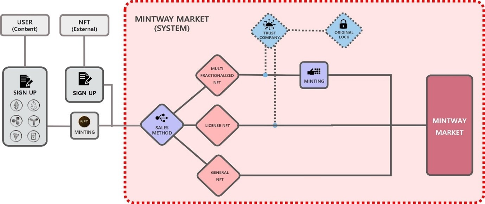
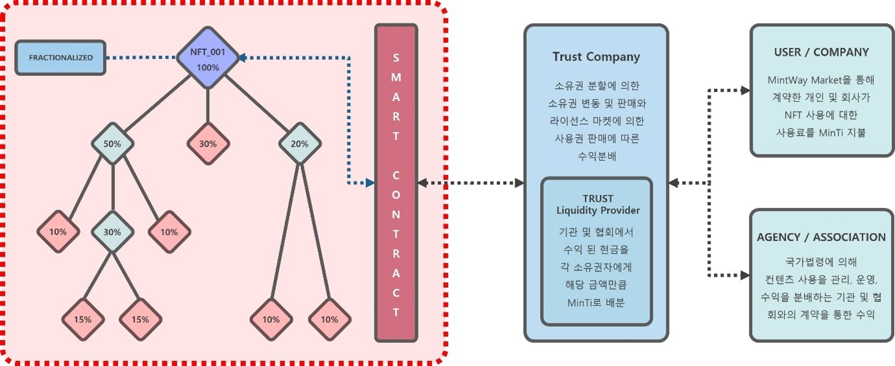
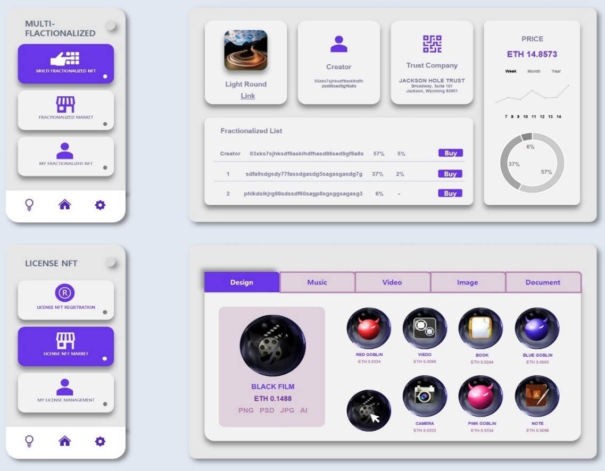

# 2. MINTWAY Market(multi-Fractionalized & License)

MINTWAY 마켓에서 제공하는 서비스는 일반 NFT마켓이 NFT를 판매하는 것과는 다르게 일반 NFT마켓에서 만든 NFT 또는 MINTWAY포탈에서 만든 NFT를 다중 분할하여 판매하거나 라이선스로 판매하는 것이 핵심이다.

NFT 다중 분할은 자신이 보유한 NFT의 소유권을 분할하는 것으로, 기술적으로는 분할 갯수에는 제한이 없으며, 분할된 NFT의 소유자가 해당 NFT를 다시 분할하는 것도 가능하다. 그러나 시스템운영의 효율성과 다단계 판매로의 악용을 방지하기 위해 최대 100개까지 분할하여 민팅할 수 있으며, 분할시에는 원본 NFT를 잠근 상태에서 MINTWAY 마켓과 연결된 신탁회사에 위탁을 해야 한다. 신탁회사에의 위탁은 원본에 대한 명확한 증명과 현재 보관되어 있는 장소, 분할된 NFT의 구매에 대한 안전성, 향후 수익 지급에 대한 불확실성을 제거하기 위함이다.

이후 NFT를 다중 분할한 소유권자는 다중분할한 NFT중 일부를 보유, 판매할 수 있고, 분할한 원본 NFT는 자동으로 라이선스 마켓에 등록되어 유저가 사용하게 함으로서 수익이 발생된다.

NFT 라이선스는 NFT 자체의 판매가 아닌 사용권을 판매하는 것으로, 이를 위해 원본 NFT는 잠근 상태에서 신탁회사에 위탁을 해야 한다.

라이선스의 비용은 신탁회사에서 관리하는 Management Fee와 수익 Performance Fee를 합쳐서, 수익이 생길 때만 MINTWAY마켓에 Service Fee를 지급하면 된다.

<figure><figcaption>
Figure 13. MINTWAY Market Usage and Revenue
</figcaption></figure>

그림과 같이 NFT를 다중 분할한 소유권자는 자신의 지분에 대해서만 관리가 가능하고 소유지분을 판매, 보유할 수 있다. 만일 자신의 NFT를 다중 분할하지 않고 NFT를 라이선스 운영만 할 경우에는 NFT 소유권 전체를 관리할 수 있으며, 관리 부분은 MINTWAY지갑에서 다시 설명하겠다.

라이선스 운영은 기본적으로 사용자와 스마트 컨트랙트로 연결되어 자동으로 수익이 분배되며, 각 국가별 법령에 의해 음원, 이미지 등을 관리하는 협회나 기관이 수익배분을 할 경우 신탁회사에서 각 협회와 계약하여, 수익화 된 현금을 MINTWAY포탈 암호화폐로 환전하여 다시 스마트 컨트랙트에 의해 각 소유권자에게 자동 분배된다.

구매자는 NFT 전체를 구매하지 않고 일부만 구매하여 자신이 보유하거나 판매할 수 있으며, 구매 전 메타데이터를 통해 NFT에 등록된 라이선스 내용을 확인할 수도 있고, 실제 라이선스 수익이 얼마인지 확인한 후 구매할 수 있다.

이와 같이 MINTWAY마켓은 지금과 같은 일반 NFT마켓 외에도 자신의 NFT의 소유권을 분할하여 판매할 수도 있고, 소유권을 판매하지 않아도 다른 사람에게 NFT를 사용하게 함으로서 수익을 올릴 수 있는 신개념마켓으로, NFT를 사용하는 모든 유저에게는 매우 편리한 마켓이 될 것이며, 전 세계에서 서비스되는 유일한 모델로서 많은 글로벌 유저들이 찾게 될 것으로 기대된다.

MINTWAY마켓에서 서비스하는 다중분할 및 라이선스의 마켓구조는 일반 NFT마켓과 달리 창작자, 신탁회사, 지분율, 현재 시세 등 더욱 자세한 정보가 제공되야 하며, 단순한 이미지를 넘어 다양한 이미지 파일을 제공하여 많은 사람이 사용할 수 있게 해야 한다.

따라서 지금과 같은 게임, 메타버스, 수집, 예술 같은 카테고리에서 벗어나 사용자가 쉽게 찾을 수 있도록 오픈마켓과 같이 대분류, 소분류, 가격 등의 내림/오름차순 등의 세밀한 카테고리로 나누고, 자신의 지갑을 통해 블록체인 네트워크에 따른 NFT를 통합관리 할 수 있게 서비스를 제공할 것이다.
