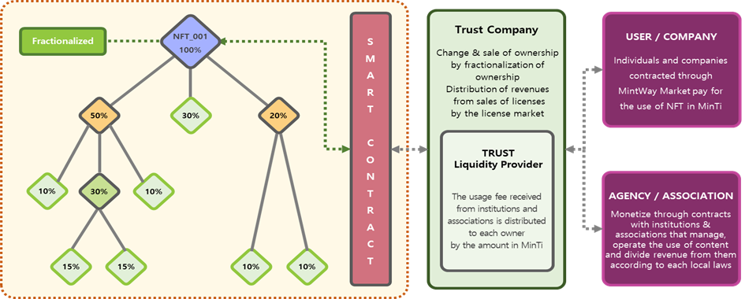

# 2. MINTWAY Market(multi-Fractionalized & License)

Unlike the general NFT market that sells NFTs in the MINTWAY market, the core of the service provided by the MINTWAY market is to divide and sell NFTs made in the general NFT market or to divide in multiple or sell as a license NFTs made in the MINTWAY portal.

NFT multiple splitting is splitting ownership of NFTs owned by NFTs. Technically there is no limit to the number of splits and the owner of a split NFT can split the NFT again. However, in order to increase system operation efficiency and prevent abuse of multi-level sales channels, up to 100 can be issued in installments. In the case of a split, the original NFT must be locked and entrusted to a trust company linked to the MINTWAY marketplace. Consignment to the trust company is for clear proof of the original, the place where it is currently stored, the safety of purchasing the divided NFT, and the removal of uncertainty about future earnings payment.

After that, the owner of the multi-fractionalized NFT can hold and sell some of the multi-fractionalized NFTs, and there is no MinTing fee for multi-fractionalization. The divided original NFT is automatically registered in the license market, and revenue is generated by allowing users to use it.

The NFT license sells the right to use the NFT rather than the sale of the NFT itself. For this, the original NFT must be locked and entrusted to a trust company.\
The license cost is a combination of the management fee managed by the trust company and the revenue performance fee, and you only need to pay the service fee to the MINTWAY market when there is a profit.

As shown in the figure, the owner of multiple divisions of the NFT can manage only his or her own stake and can sell and hold the ownership stake. If you do not divide your own NFT and operate only the license operation of the NFT, you can manage the entire ownership of the NFT, and the management part will be explained again in the MINTWAY wallet.

The license operation is basically connected to the user and the smart contract, and revenue is automatically distributed. Because an association or institution that manages sound sources and images distributes profits according to the laws of each country, the trust company signs a contract with each association, converts the monetized cash into MINTWAY portal cryptocurrency, and then back to each owner automatically distributed them by a smart contract.

A buyer can purchase only a part of the NFT rather than the entire NFT and own or sell it, check the license details registered in the NFT through metadata before purchase, or purchase after confirming the actual license revenue.

As such, the MINTWAY market is a new concept market in which, in addition to the general NFT market like now, you can fractionalize and sell your own NFT ownership, and you can make a profit by letting others use the NFT without selling the ownership. It will be a very convenient market for all users, and it is expected that many global users will find it as the only model serviced worldwide.

Unlike the general NFT market, the multi-fractionalization and license market structure provided by the MINTWAY market requires more detailed information such as creator, trust company, share ratio, and current market price and should go beyond simple images and provide a variety of image files for use by many people.

Therefore, breaking away from categories such as games, metaverses, collections, and art as now, it is divided into detailed categories such as large categories, sub-categories, and descending/ascending order like the open market so that users can easily find them, and is provided the services for integrated management of NFT by the blockchain through their wallets.
