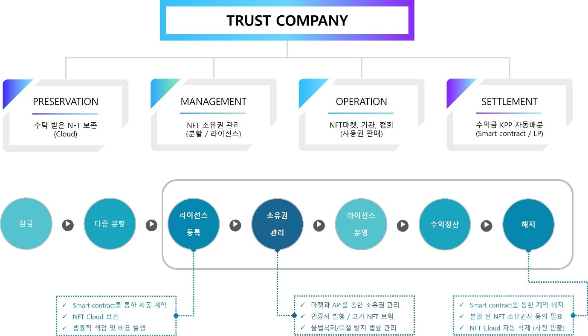

# 3. Trust company

<figure><figcaption>
Figure 15. Trust Company System
</figcaption></figure>

현재까지 NFT마켓에서는 자신이 직접 거래하는 형식이었지만 NFT에 대한 소유권 및 사용권을 실질적으로 관리하지 못하는 것이 현실이다.

대부분의 NFT마켓에서 보여지는 창작물은 누구나 이미지를 복사하여 사용할 수 있고 불법복제 및 표절에 대해 관리하지 못하고 있으며 클라우드나 서버에 올린 데이터 원본이 사라질 경우 자산가치에 대한 보상을 받지 못하는 문제가 있다.

지금도 대부분의 NFT 마켓은 이러한 문제를 해결하기 위한 가시적 노력은 보이고 있지 않으며 책임소재도 불투명하다. 이것이 실제 금과 같은 자산이라면 이렇게 운영할 NFT마켓은 존재하지 않을 것이다.

우리는 NFT의 소유권과 사용권에 대한 자산을 거래하고 라이선스를 판매하는 마켓을 운영하기 때문에 이러한 문제에 대해 특히 관리가 철저해야 하며, 디지털 자산의 특성인 불법복제 및 표절 가능성에 대해 법적인 관리가 가능해야 한다.

따라서 MINTWAY마켓에서는 NFT를 다중분할 하거나 라이선스 판매를 위해서는 반드시 해당 NFT를 잠근 상태에서 라이선스를 등록해야 한다. 등록과 동시 스마트 컨트랙트에 의해 자동으로 계약되며, 잠긴 NFT는 신탁회사가 관리하는 스토리지에 반드시 올려야 계약이 완료된 것으로 판단한다. 이때부터 신탁회사와 실질적인 법적 효력이 발생하며 이후부터는 신탁회사에서 소유권을 관리하게 된다.

등록된 NFT는 창작자와 창작품, 내용 등이 포함된 신탁회사 명의의 인증서가 생성되며 이는 누구나 볼 수 있도록 공개된다. 또한 별도의 계약을 통해 인증서를 바탕으로 무단사용 및 불법복제 등을 한 사람은 신탁회사 법률팀에 의해 고발될 수 있으며, 고가의 NFT의 경우는 보험에 가입할 수도 있다.

또한 데이터 원본에 대한 보안을 위해 미국의 클라우드 보안인증 기관 FedRAMP PMO에서 지정한 NST SP 800-53 인증기준을 획득한 클라우드 업체와 계약을 통해 안전하게 데이터를 보관할 것이다.

이러한 관리를 통해 신탁회사는 MINTWAY마켓 및 각 국가의 협회, 관련기관과 계약을 통해 글로벌 유저에게 사용권을 판매하게 되며, 이 수익에 대한 Service Fee를 제외하고 NFT 소유권자에게 스마트 컨트랙트에 의해 지급된다.

이때 각 국가 및 관련기관에서는 사용에 대한 수익을 현금으로 받기 때문에 신탁회사 외부의 LP를 통하여 MINTWAY마켓에서 사용할 수 있는 암호화폐로 지급하게 된다.

계약의 해지는 MINTWAY마켓 또는 MINTWAY포탈에서 서비스하는 NFT 통합지갑을 통해 해지할 수 있고 이때 클라우드에서는 자동으로 파일이 삭제되니 사전에 원본 데이터를 인출해야 한다. 또한 분할 된 NFT의 경우는 소유권자 전체의 동의가 있어야 한다.

이렇게 MINTWAY마켓은 NFT를 실제자산과 동일하게 보존, 관리, 운영하여 소유권자의 자산의 가치와 수익을 보장한다.

